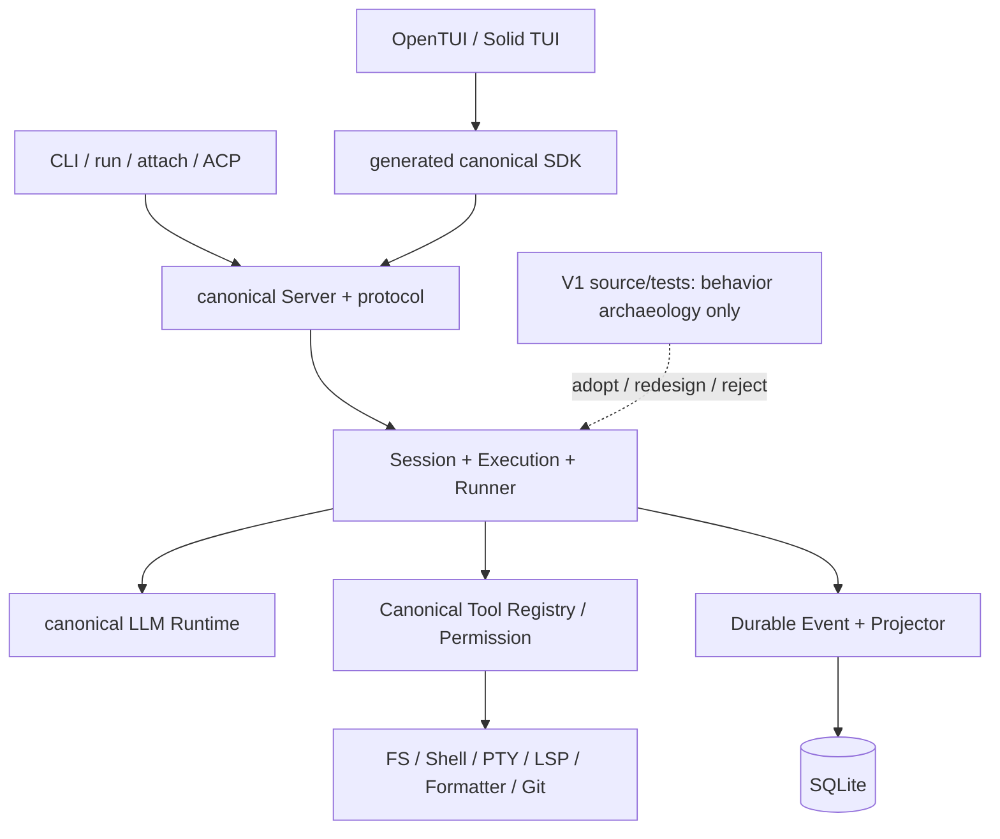
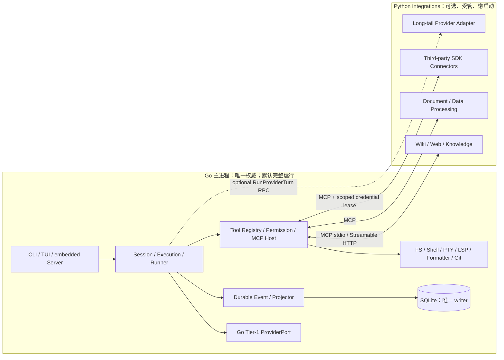

# OpenCode Go Core + Python Integrations V2-only 实现总计划

> 唯一总入口。本文只描述规划，不代表任何复刻功能已经实现。

| 项目 | 值 |
|---|---|
| 上游仓库 | `/Users/zhanghongze/PycharmProjects/opencode` |
| 目标仓库 | `/Users/zhanghongze/PycharmProjects/opencode-go-py` |
| 冻结分支 | `dev` |
| 冻结 Commit | `89130db6b0060a345548d870c51132ee71d6a828` |
| 上游版本 | `1.18.11` |
| Commit 时间 | `2026-08-03T10:07:49Z` |
| 分析日期 | `2026-08-03`（Asia/Shanghai） |
| 计划状态 | `planning-v2-only` |
| 功能状态初值 | 全部 `pending` |

## 范围决策：只实现 canonical V2

自 `2026-08-03` 起，本项目采用 **V2-only** 路线：目标运行时只有一套不带版本后缀的 `Session + Execution + Runner`。上游源码中的 `SessionV2`、`SessionExecution`、`SessionRunCoordinator`、`SessionRunnerLLM` 是主要实现依据；复刻版内部直接命名为 `Session`、`Execution`、`Coordinator`、`Runner`，避免把迁移期名称固化为永久架构。

以下内容明确不进入目标实现：

- `SessionPrompt + SessionProcessor` V1 主循环及其 AI SDK runtime。
- legacy Session HTTP route、旧 SDK 表面和 V1 Message/Part 双写投影。
- Permission V1、Plugin V1 BunShell/Hooks ABI 及 JS/Bun compatibility sidecar。
- 为物理兼容上游旧 SQLite 而保留的 legacy 表、事件和运行时 mapper。

V1 源码和测试只作为**行为考古材料**：对 V2 尚未覆盖但产品仍需要的能力，先登记行为与边界，再使用 V2 的 Event、Inbox、Runner、Registry 和 Permission 模型重新实现；不得复制 V1 的控制流、状态所有权或持久化结构。可选的一次性数据导入必须位于边界 adapter，不能污染 canonical Domain、Event 或运行时表。

**优先级编排（本机优先路线，2026-08-04）**：本项目以“本机单机运行”为默认场景。实施按三档优先级编排，**低档内容只置后、不删除**，达到重点里程碑或确有需要时再启动：

| 档位 | 内容 | 说明 |
|---|---|---|
| 高（核心，最先） | Agent 逻辑全套：Session/Execution/Runner、Event/SQLite/Projector、Tool/Permission/Question、Agent/Subagent/System Context/Scheduler、Compaction/Retry/Snapshot；**ProviderPort、fake Provider 与 Go Tier-1 adapters** | 决定“会思考、会记忆、会执行”的核心能力 |
| 中（产品外壳） | CLI/run、HTTP/OpenAPI/SSE/WS/SDK、MCP/Skill、TUI、ACP/LSP/PTY/Formatter | 让核心可被使用 |
| 低（最后/可跳过） | **长尾 Provider 与可选 Provider RPC**；**部署/发布**（安装/升级/签名/公证/SBOM/跨平台 release）；企业集成（Share/GitHub/GitLab） | Tier-1 Go adapters 不在此档；只有真实长尾需求或需要对外分发时才启动 |

对应地，第 9 章各阶段人月已按此口径重估（P5、P15、P16、P17 相应下调），P16 默认标记“可选、本机可跳过”，不计入完成门槛。

## 阅读约定与证据等级

本文使用四类陈述，避免把规划意见伪装成上游事实：

- **源码事实**：由冻结 Commit 的源码、Schema 或测试直接证实。
- **调用链判断**：由多个真实调用点组合得到，仍应通过差分测试确认全部边缘行为。
- **复刻版设计**：本计划为 Go + Python 版本提出的设计，不是上游现状。
- **未确认项**：源码仍在迁移、产品要求存在互斥解释，或必须通过真实平台/Provider 验证。

文中的源码路径均指冻结 Commit；关键证据在“附录 A：证据索引”集中给出真实文件和行号。V2 Feature Matrix 的 `状态` 只允许 `pending / in_progress / blocked / verified / superseded`，本计划创建时全部为 `pending`。

## 0. 详细设计与实施入口

主计划负责范围、决策、阶段门槛和总状态；以下补充文档负责可以直接进入评审/实施的结构体、DDL、调用链、示范代码与逐步任务。补充文档不能单独改变 Feature 状态，发生冲突时先更新 ADR，再同步本入口与对应文档。

| 文档 | 解决的问题 | 主要覆盖阶段 | 状态 |
|---|---|---|---|
| [核心运行时、状态机与执行链详细设计](design/CORE_RUNTIME_BLUEPRINT.md) | Prompt admission、Runner/Tool/Permission 状态机、事务、并发、取消与恢复 | P4、P6、P8、P9 | 设计草案 |
| [SQLite、表结构、索引与迁移详细设计](design/DATABASE_BLUEPRINT.md) | canonical V2 DDL、索引、事务、migration、replay/rebuild、完整性与容量 | P3、P4、P9 | 设计草案 |
| [Python Integration Runtime、Provider RPC 与跨语言边界详细设计](design/RPC_AND_TYPES_BLUEPRINT.md) | MCP 工具、P14+ 可选长尾 Provider Worker、跨语言类型、取消、版本、打包与安全边界 | P7、P14、P16 | 设计草案 |
| [P0–P9 canonical 核心链路实施手册](phases/PHASE_IMPLEMENTATION_P0_P9.md) | 每阶段目标/非目标、目录、逐步任务、代码、测试、回滚、DoD | P0–P9 | 规划草案 |
| [P10–P17 产品外壳、生态与发布实施手册](phases/PHASE_IMPLEMENTATION_P10_P18.md) | Server/CLI/TUI/系统能力/插件/集成/发布/全量差分的逐步实施 | P10–P17 | 规划草案 |

---

## 1. 项目愿景

### 1.1 为什么复刻

本项目是**V2-only 学习型实现**，不复刻上游迁移期的 V1/V2 双栈。它以 OpenCode canonical V2 为架构与行为参考，目标是掌握并实践 Durable Agent 的状态所有权、投影、恢复、流式协议和扩展宿主，以及 admission→wake、steer/queue、durable event 先于副作用、settlement 后重载历史等独有决策。

语言定位采用“**Go canonical Core + Python Integrations**”：Go 建立可独立运行、默认单二进制/单进程的权威核心，完整拥有 Session、Execution、Runner、Tier-1 Provider、Event、SQLite、Tool Registry、Permission、MCP host、终端和文件系统；Python 不再是每次模型调用的必经后端，而是由 Go 按能力懒启动的可选集成运行时，重点复用 Python 库实现知识源、Wiki/Web Fetch、文档与数据处理、第三方 SaaS connector、长尾 Provider 和对照实验。Python 生产工具通过 OpenCode 已有语义对应的 MCP Tool/Resource/Prompt 进入 Go Registry，仍由 Go permission、durable settlement 和生命周期管理，不建立第二套 Agent Loop 或状态真相。

“让现有 legacy 客户端、旧 SDK、旧数据库和 V1 Plugin 零修改切换”不再是目标。核心自研层与协议适配层只对齐选定的 canonical V2 contract；对照实验层不进入产品完成状态（见第 8.1 节）。

### 1.2 “完整 V2 实现”的可验证定义

完整 V2 实现同时要求：

1. 功能面覆盖 CLI、TUI、Server、SDK、Session、Provider、Tool、MCP、Skill、ACP、LSP、PTY、安装升级和第三方集成。
2. 同一输入与受控外部依赖下，canonical HTTP 状态码与错误体、SSE/WebSocket 帧、Durable Event 序列、SQLite 投影、Tool/Permission 决策和 Provider 请求达到约定的 V2 行为等价。
3. 取消、并发、崩溃、恢复、幂等重试和资源清理具有相同的可观测结果，而非只覆盖成功路径。
4. macOS、Linux、Windows 的公开行为均有平台测试；允许底层实现不同，不允许公开语义无记录地漂移。
5. 只为 canonical V2 表面建立契约；上游 V1 表面登记为 `out-of-scope archaeology`，不得进入运行时、公开协议或完成门槛。

### 1.3 非目标与阶段性妥协

- 本次规划不实现代码、不引入依赖、不修改上游。
- 早期里程碑不以“内部结构长得像 OpenCode”为目标，而以可测的外部契约为目标。
- MVP 可以只启用少量 Provider；未进入选定 V2 scope 的长尾 Provider 不得被误标为完成。
- canonical Core 的 clean install、启动、核心旅程和发布完成不得依赖 Python；启用 Python integrations 是显式 capability/profile，而不是隐式后台前置。
- Wiki、文档处理、数据分析和 SaaS connector 等新增 Python 工具属于扩展能力；必须复用 canonical MCP/Tool/Permission 边界，不能伪装成上游已有功能，也不计入 OpenCode V2 行为等价完成度。
- 不追求复刻 Effect/Layer 的 TypeScript 语法；需要复刻的是作用域、依赖、取消、释放和错误语义。
- 不让任何框架（LangGraph、Eino、LangChain、PydanticAI 等）成为核心自研层（8.1 L1）的 Session、Permission、Tool settlement、Event Store 或 SQLite 的第二权威状态；它们只允许出现在对照实验层（L3）或协议适配层的长尾槽位（L2）。
- 对照实验层（L3）的实现永远标 `pending`，不进入 `verified` 状态；其验收标准是“学习产出”而非产品完成度（见 13 章说明）。
- 不提供 TypeScript/Bun V1 Plugin ABI 或旧 JS SDK runtime compatibility；新的扩展面必须通过 V2 contract 重新设计为版本化边界。

---

## 2. OpenCode 基准信息

### 2.1 冻结基线

源码事实：分析基线为 `dev@89130db6b0060a345548d870c51132ee71d6a828`，版本 `1.18.11`，工作区在分析前为干净状态。以后所有行为差异必须同时记录“复刻目标 Commit”和“当前上游 Commit”，不得用滚动的 `dev` 作为模糊目标。

### 2.2 License

上游为 MIT License。复刻可以使用、修改、分发和商业化，但必须保留版权与许可声明。若复制源码、Prompt、前端资产、测试 fixture 或生成代码，需在对应发行物及源分发中保留 MIT 文本；第三方 Provider SDK、图标、字体、PTY、模型 cassette 和打包工具还需单独生成 SBOM 与许可证清单，不能只继承仓库根 License。

### 2.3 规模快照

只读统计结果：冻结仓库含 6,358 个 tracked files；选定源码约 651,662 行；发现 718 个 `test/spec` 文件，测试目录约 695 个代码文件。该数字用于估算，不作为精确的语言统计；上游 Monorepo 还包含生成物、资产、录制 fixture 和平台打包内容。

### 2.4 规划含义

即使移除 V1/legacy 双栈，这仍是多年级工程。下文 18 个阶段（P0–P17）需在 P0 重新估算；当前 canonical Go Core 粗估为 136 人月，加上 25%–35% 的硬化、上游漂移、平台签名与外部服务缓冲，预算约 170–184 人月。**按本机优先路线（2026-08-04）保留 Go Tier-1 adapters、部署/发布置后后，base 约 122 人月，加缓冲后约 153–165 人月（见第 9 章调整记录）**。首批 Python integrations 另估 4–8 人月并分开记账。该数字是范围控制基线，不是交付承诺；任何显著更短的周期仍必须明确削减 Provider、Plugin、跨平台或产品外壳范围。

---

## 3. OpenCode 整体架构

### 3.1 Monorepo 包关系

源码事实与依赖清单组合得到以下方向：

| 包 | 当前职责 | 关键依赖方向/迁移说明 |
|---|---|---|
| `packages/schema` | 语言无关意图最强的 Event、Session、Message、Permission 等 Schema | 底层契约；新路径应从这里生成协议 |
| `packages/protocol` | Effect HttpApi 的 `/api` endpoint、OpenAPI 注解、cursor | `schema <- protocol` |
| `packages/llm` | canonical LLM schema、route、protocol/framing/transport、retry | 被 `core` 使用；与旧 AI SDK runtime 并行 |
| `packages/core` | Durable Event、SQLite、Projector、V2 Session/Runner、Tool、Permission、系统能力 | `core -> schema + llm + plugin + SQLite adapters` |
| `packages/server` | 新协议 handlers、SSE、embedded routes | `server -> protocol + core` |
| `packages/client` | 新协议客户端 | `client -> schema + protocol` |
| `packages/sdk-next` | in-process embedded server/client 组合 | `sdk-next -> client + core + server` |
| `packages/opencode` | 现有产品组合层：legacy 与新核心、CLI、Server、MCP、LSP、Config、集成 | 当前仍同时装配 V1/V2 |
| `packages/sdk` | 现有 V1/V2 JS SDK 与生成表面 | TUI 仍有 compatibility consumer |
| `packages/tui` | OpenTUI/Solid TUI | 经 SDK、事件上下文消费 server |
| `packages/plugin` | V1 Hooks 与 V2 Effect/Promise ABI | V1 暴露 BunShell，完整兼容需要 JS/Bun 宿主 |
| `packages/codemode` | 受限解释器、工具树、预算、渐进发现 | 独立运行时和错误数据模型 |

### 3.2 Service、Layer 与实例作用域

源码事实：当前代码大量使用 Effect `Context.Service`、`Layer`、Scope finalizer、`InstanceState` 与 Location/Workspace ref。它们表达四个必须复刻的语义，而不是必须照搬的库：

1. 全局单例、Location 级、Project/Instance 级依赖必须明确分域。
2. 请求进入时解析目录/Workspace，不能依赖一个全局 `cwd`。
3. LSP、MCP、PTY、watcher、Plugin registration 等资源随作用域关闭。
4. interrupt/defect/普通错误不同，不能统一吞成字符串。

复刻版设计：Go 用显式 `App -> Workspace -> Location -> SessionRun` scope、`context.Context` 和幂等 `Close()` 替代 Effect；禁止 service locator 式隐式全局状态。每个 scope 有生命周期测试和泄漏指标。

### 3.3 上游双栈事实与本项目 V2-only 选择

源码事实：

- V1 主链是 `SessionPrompt.prompt/loop` 与 `SessionProcessor`；旧 Session 默认 AI SDK，Native LLM Runtime 由实验开关选择。
- 新 Durable Session 由 `SessionV2`、`SessionExecution`、`SessionRunCoordinator` 和 `SessionRunnerLLM` 组成；输入先持久化，再 advisory wake。
- Session Projector 同时消费 legacy 与新 Session Event；新 Schema 指南表明 `V2` 最终应消失，legacy 只是迁移兼容，而非永久双模型。
- V2 Runner 已实现单 turn 单次 `llm.stream`、工具事件持久化、并发工具执行、历史重载与 overflow compaction；源码 TODO 仍明确缺少集群 durable ownership、完整 busy/retry 状态、stale attachment fencing、完整 registry 和 maintenance。

项目决策：上述 V1 链路只用于识别 V2 尚未补齐的产品行为。本项目从第一版开始只建立 canonical 新模型，不提供 legacy API/Event/DB projection 适配，也不等待上游正式删除 V1。V1 中仍有价值的行为必须经过 `adopt / redesign / reject` 评审后，使用 V2 状态机重新实现。

### 3.4 Server/Client/UI 边界

源码事实：CLI 入口用 yargs 装配二十余命令；默认 TUI 会创建 worker，通过 RPC 转发 fetch/global events，并在 worker 内监听 server。`serve` 不绑定启动时 ambient project，而由请求头/中间件解析 Instance。新 SSE 使用 bounded subscriber；PTY 使用 WebSocket、一次性 ticket、Origin/Auth 校验与 cursor replay。`sdk-next` 可直接把 routes 嵌入进程。

### 3.5 V2-only 目标调用图



> 复刻范围说明：上游的 Web App（`packages/app`）与 Desktop（Electron）客户端**不在复刻范围内**，已从图中剔除；复刻版只保留 CLI/TUI 等终端客户端，并通过 SDK/Server 接入同一核心。

---

## 4. V2 功能清单（Feature Matrix）

难度：`M` 中、`H` 高、`VH` 极高。阶段编号见第 9 章。每一行的完成都必须满足第 13 章，不以“已有代码”作为完成。默认行为归类为 `canonical`；明确写有“复刻版扩展”的行归类为 `replica-extension`，按自身 contract 验收且不得参与 upstream 行为等价百分比；L3 实验不进入本表。Core release 只门禁 canonical 行，完整 Go + Python integrations profile 还门禁其声明包含的 extension 行。

| 功能 | OpenCode 源码位置 | 当前行为 | 依赖 | Go/Python 归属 | 阶段 | 测试依据 | 难度 | 状态 |
|---|---|---|---|---|---|---|---|---|
| CLI 命令树/错误/补全 | `packages/opencode/src/index.ts:45` | yargs 装配 run/tui/serve/acp/mcp/auth/upgrade 等命令 | Config、Server | Go | P11 | `test/cli/help/help-snapshots.test.ts:1` | H | pending |
| `run` 非交互/mini UI | `opencode/src/cli/cmd/run.ts:126` | SDK 流、stdin、permission/question/footer、trace | Session API、SSE | Go | P11 | `test/cli/run/session-replay.test.ts:1` | H | pending |
| TUI | `packages/tui/src/app.tsx:186` | OpenTUI/Solid，SDK + event context，worker/attach 模式 | CLI、SDK、PTY | Go UI | P12 | `packages/tui/test/config.test.tsx:1` | VH | pending |
| HTTP Server 组合 | `packages/server`、`packages/protocol` | canonical `/api`、middleware、OpenAPI | Protocol、Workspace | Go | P10 | `packages/server`、`packages/protocol` tests | H | pending |
| Auth/CORS/compression/error | `opencode/src/server/routes/instance/httpapi/middleware/authorization.ts:101` | Basic auth、公开 UI 例外、CORS Vary、压缩、规范错误体 | Server Config | Go | P10 | `httpapi-authorization.test.ts:1` | H | pending |
| SSE 全局事件 | `packages/server/src/handlers/event.ts:20` | bounded stream，慢消费者隔离 | Event、SSE | Go | P10 | `httpapi-event.test.ts:44` | H | pending |
| Session durable SSE/history | `protocol/src/groups/session.ts:307` | 历史分页后 tail，exclusive sequence | Event Store | Go | P10 | `core/test/session-history.test.ts:43` | VH | pending |
| PTY HTTP/WebSocket | `core/src/pty/protocol.ts:1`、canonical route | ticket、Origin、cursor replay | PTY、Auth | Go | P13 | `core/test/pty/protocol.test.ts:1` | VH | pending |
| OpenAPI/SDK | `protocol/src/groups/session.ts:106` | Schema 驱动 canonical endpoint 和 SDK | Schema、Server | Go generator | P10 | `packages/protocol` contract tests | H | pending |
| Embedded SDK | `sdk-next/src/opencode.ts:10` | in-process route handler/fetch | Server、Client | Go library | P10 | `sdk-next/test/embedded.test.ts:1` | H | pending |
| ID/时间/cursor | `protocol/src/groups/session.ts:65` | opaque base64url cursor、稳定 ID 约束 | Schema | Go canonical；Python 仅边界生成 | P1/P7 | `protocol/test/session-cursor.test.ts:1` | M | pending |
| Session CRUD | `core/src/session.ts:1` | canonical durable create/update/model/agent/revert；移除对 `SessionV1.Event.Created` 的依赖 | Event、Projector | Go | P8 | `core/test/session-create.test.ts:50` | VH | pending |
| Prompt admission | `core/src/session.ts:360` | 先 `PromptAdmitted`，ID exact retry 幂等，冲突拒绝 | Event、Inbox | Go | P8 | `core/test/session-prompt.test.ts:143` | VH | pending |
| `steer/queue` | `core/src/session/input.ts:245` | steer 批量、queue FIFO 单个、安全边界提升 | Runner、Inbox | Go | P8 | `core/test/session-runner.test.ts:1811` | VH | pending |
| 单 Session 串行调度 | `core/src/session/run-coordinator.ts:24` | 同 key join/wake 合并，不同 key 并行 | Context、Runner | Go | P8 | `session-run-coordinator.test.ts:8` | VH | pending |
| SessionMessage/Content 全类型 | `schema/src/session-message.ts:44` | user/system/assistant/tool/shell/compaction 等 | Schema、Projector | Go canonical | P1 | `session-runner-message.test.ts:50` | H | pending |
| Durable Event schema | `schema/src/event.ts:15` | type/data/durable/location/metadata | ID、Location | Go + generated | P1/P4 | `core/test/event.test.ts:86` | VH | pending |
| Event transaction/sequence | `core/src/event.ts:205` | event、projector、sequence 同 immediate transaction | SQLite | Go | P4 | `core/test/event.test.ts:175` | VH | pending |
| Event replay/ownership | `core/src/event.ts:565` | 历史 + wake tail、claim/fencing/replay 校验 | Event DB | Go | P4 | `core/test/event.test.ts:422` | VH | pending |
| Session Projector | `core/src/session/projector.ts:211` | 仅 canonical Event 投影，sequence 排序 | Event、SQLite | Go | P4/P8 | canonical projector tests | VH | pending |
| SQLite migrations | `core/src/database/database.ts:1` | schema/migration/transaction adapter | filesystem | Go | P4 | `core/test/database-migration.test.ts:1` | VH | pending |
| System Context epoch | `core/src/system-context/index.ts:197` | typed source snapshot、reconcile、replace/unavailable | Config、Agent | Go | P8 | `core/test/system-context/index.test.ts:1` | H | pending |
| Session Runner | `core/src/session/runner/llm.ts:205` | 每 turn 单 stream，持久化工具、重载历史；不引入 Processor | LLM、Event | Go orchestration | P9 | `session-runner.test.ts:557` | VH | pending |
| Provider catalog/model | `opencode/src/provider/provider.ts:1` | models.dev、配置、credential、动态 SDK/model options | Config、Plugin | Go catalog + adapter | P5（弱化：直连 API 优先） | `test/provider/provider.test.ts:1` | VH | pending |
| Native LLM route | `llm/src/route/client.ts:226` | protocol/endpoint/auth/framing/transport 正交组合 | HTTP、Auth | Go | P5 | `llm/test/adapter.test.ts:109` | VH | pending |
| canonical `LLMEvent` | `llm/src/schema/events.ts:78` | text/reasoning/tool delta/call/result/error/finish | Stream schema | Go Domain；可选 Wire mapper | P1/P5 | `llm/test/schema.test.ts:17` | VH | pending |
| HTTP retry/脱敏 | `llm/src/route/executor.ts:35` | 默认最多重试 2 次、jitter、Retry-After、redaction | Transport | Go | P5 | `llm/test/executor.test.ts:75` | H | pending |
| Provider protocol 矩阵 | `llm/src/providers/index.ts:1` | canonical V2 的 OpenAI Responses、Anthropic、OpenAI-compatible；长尾显式扩展 | Framing、Auth | Go Tier-1；P14+ 可选长尾 RPC | P5/P14/P17 | `llm/test/provider/openai-responses.test.ts:42` | VH | pending |
| Usage/cost/cache metadata | `opencode/src/session/compaction.ts:1` | cache read/write、reasoning、tier cost、Copilot billed | Provider metadata | Go normalize/persist | P5/P9 | `test/session/compaction.test.ts:1541` | H | pending |
| Tool schema/registry | `core/src/tool/registry.ts:1` | scoped registration、model definition、stale fencing | Schema、Policy | Go | P6 | `session-runner-tool-registry.test.ts:61` | VH | pending |
| 内建文件/Shell工具 | `core/src/tool/builtins.ts:1` | read/edit/write/patch/bash/search/web 等边缘约束 | FS、Process、Permission | Go | P6 | `core/test/tool-bash.test.ts:135` | VH | pending |
| Tool lifecycle/settlement | `core/src/session/runner/llm.ts:243` | call 先 durable，工具并发，结果 durable 后续跑 | Event、Registry | Go | P6/P9 | `session-runner-tool-events.test.ts:72` | VH | pending |
| Structured Output | `opencode/src/session/prompt.ts:1243` | 强制 `StructuredOutput` tool、schema validation/retry | LLM、Tool | Go | P9 | `test/session/structured-output-integration.test.ts:17` | H | pending |
| Permission | `core/src/permission.ts:76` | canonical action/resource/effect，leaf 捕获授权 | Policy、Event | Go | P6 | `core/test/permission.test.ts:105` | VH | pending |
| Question/approval UI | `core/src/question.ts:1` | pending request、answer/dismiss、取消传播 | Session、UI | Go | P6/P12 | `core/test/question.test.ts:1` | H | pending |
| MCP transports | `opencode/src/mcp/index.ts:164` | stdio/Streamable HTTP/SSE、动态 tools changed、清理 | Process、HTTP | Go | P7 | `test/mcp/transport.test.ts:1` | VH | pending |
| MCP OAuth | `opencode/src/mcp/index.ts:218` | browser callback/token/provider、自动重连 | Auth、Server | Go | P7 | `mcp/oauth-callback.test.ts:1` | VH | pending |
| MCP tool/resource/prompt | `opencode/src/mcp/index.ts:492` | tools/resources/prompts、二进制附件上限 | Tool Registry | Go | P7 | `mcp/catalog.test.ts:1` | H | pending |
| Python 知识源/数据/SaaS connector | canonical MCP Tool/Resource/Prompt 边界 | `[replica-extension]` Wiki、Web、文档、数据与第三方 SDK；不冒充上游功能 | MCP、Registry、Permission | Python 可选，Go host/settlement | P7/P14 | MCP contract + connector fixtures | H | pending |
| Skill discovery | `opencode/src/skill/index.ts:173` | 全局/项目/自定义/远程 index | Config、FS、HTTP | Go | P7 | `core/test/skill-discovery.test.ts:1` | H | pending |
| Agent 配置/默认选择 | `core/src/agent.ts:1` | build/primary/subagent、model/system/steps/permissions | Config、Skill | Go | P8 | `core/test/agent.test.ts:1` | H | pending |
| 子代理 | `opencode/src/tool/task.ts:92` | child Session + parentID、resume、depth、结果注回父级 | Session、Tool | Go | P8 | `test/permission-task.test.ts:1` | VH | pending |
| 后台代理/任务 | `core/src/background-job.ts:1` | durable job/实验开关/父子协调仍在演进 | Session、Scheduler | Go | P8 | `core/test/background-job.test.ts:1` | VH | pending |
| Compaction | `core/src/session/runner/llm.ts:277` | 自动/强制摘要，overflow 后最多一次恢复 | Provider、Event | Go | P9 | `session-runner.test.ts:1085` | VH | pending |
| Retry/Overflow | `opencode/src/session/retry.ts:1` | 错误分类、header/exponential delay、取消 | Provider | Go | P5/P9 | `session/retry.test.ts:35` | VH | pending |
| Snapshot/Diff/Revert | `opencode/src/snapshot/index.ts:319` | 独立 git dir/index、track/patch/restore/revert/diffFull | Git、Session | Go | P9 | `core/test/snapshot.test.ts:15` | VH | pending |
| Project/Instance/Location | `opencode/src/project/project.ts:1` | VCS 根、worktree、directory、Instance scope | FS、Git、Config | Go | P3 | `test/project/project.test.ts:1` | H | pending |
| Workspace routing | `opencode/src/server/routes/instance/httpapi/middleware/workspace-routing.ts:130` | header/location 路由、HTTP/WS proxy | Server、Project | Go | P10 | `httpapi-workspace-routing.test.ts:1` | VH | pending |
| Worktree | `opencode/src/worktree/index.ts:1` | 创建/删除/重置、分支与 bootstrap | Git、Project | Go | P3 | `project/worktree.test.ts:1` | VH | pending |
| Config merge | `opencode/src/config/config.ts:351` | 远程/全局/项目/目录/inline/org/managed 层叠；instructions 拼接去重 | Auth、FS、HTTP | Go canonical；可选 runtime 只收最小快照 | P3 | `test/config/config.test.ts:1` | VH | pending |
| Auth/Credential/OAuth | `opencode/src/auth/index.ts:1` | api/oauth/wellknown credential 与 Provider auth | Config、Plugin | Go secret store；connector 短期 lease | P3/P5/P7 | `test/auth/auth.test.ts:1` | VH | pending |
| Plugin/扩展 V2 contract | `plugin/src/v2/promise/plugin.ts:3` | 提取 setup/register/reload/dispose 语义；优先复用 MCP，自定义 hook 边界另行版本化 | Plugin domains | Go host + 可选 Python adapter | P14 | canonical plugin lifecycle tests | VH | pending |
| 自定义 Tool | `opencode/src/tool/registry.ts:1` | `.opencode/tool` 与 plugin tool 合并 | Plugin、Permission | Go native + JS adapter | P14 | `test/tool/registry.test.ts:1` | H | pending |
| CodeMode | `codemode/src/codemode.ts:9` | 受限程序、工具预算、诊断数据、并发上限 | Tool Registry | Go sandbox 或隔离 sidecar | P14 | `codemode/test/codemode.test.ts:12` | VH | pending |
| PTY core | `core/src/pty/protocol.ts:7` | cursor meta frame、64KiB replay chunks、输入解码 | platform PTY | Go | P13 | `core/test/pty/protocol.test.ts:1` | VH | pending |
| LSP | `opencode/src/lsp/lsp.ts:208` | lazy spawn、root、push/pull diagnostics、shutdown | Process、Config | Go | P13 | `test/lsp/lifecycle.test.ts:1` | VH | pending |
| Formatter | `opencode/src/format/index.ts:73` | 按扩展/配置选 formatter，顺序运行并记录错误 | Process、Config | Go | P13 | `test/format/format.test.ts:1` | H | pending |
| ACP | `opencode/src/acp/service.ts:92` | initialize/auth/new/load/list/fork/prompt/cancel/update | SDK、Session | Go | P13 | `test/cli/acp/lifecycle.test.ts:1` | VH | pending |
| Share | `opencode/src/share/share-next.ts:1` | 分享创建/同步/撤销与事件 | Auth、HTTP | Go | P15（可后置） | `test/share/share-next.test.ts:1` | H | pending |
| GitHub/PR action | `opencode/src/cli/cmd/github.ts:1` | 安装/运行 GitHub workflow、评论/PR 集成 | Auth、Git、Session | Go | P15（可后置） | `test/cli/github-action.test.ts:1` | VH | pending |
| GitLab Duo | `opencode/test/provider/gitlab-duo.test.ts:1` | GitLab Provider/credential 特殊路径 | Provider、Auth | RPC/Python 可选 adapter | P15（可后置） | `test/provider/gitlab-duo.test.ts:1` | H | pending |
| 安装/升级 | `opencode/src/installation/index.ts:174` | curl/npm/pnpm/bun/brew/scoop/choco 检测与升级 | Release、网络 | Go | P16（可选，本机可跳过） | `test/installation/installation.test.ts:1` | H | pending |
| 签名/公证/发布 | Core 与可选 integration artifact 分层签名 | macOS notarize、Windows sign、CLI/TUI 发布 | CI、证书 | Go core；Python profile 独立 | P16（可选，本机可跳过） | release rehearsal | VH | pending |
| 导入/导出/DB 工具 | `opencode/src/cli/cmd/export.ts:1` | Session 数据交换、维护命令 | Schema、DB | Go | P11 | `test/cli/import.test.ts:1` | H | pending |
| 遥测/日志/诊断 | `core/src/observability/logging.ts:1` | 结构化日志、debug/heap/trace、错误引用 | 全局 | Go + Python trace context | P2/P17 | `core/test/effect/observability.test.ts:1` | H | pending |

### 4.1 优先级档位与实施顺序（本机优先）

上文与第 9 章的分阶段路线按三档优先级编排，**低档内容只置后、不删除**，达到重点里程碑或确有需要时再启动（详见“范围决策”末尾的优先级编排表）：

1. **高档（核心，最先）**：Agent 逻辑全套——Session/Execution/Runner、Event/SQLite/Projector、Tool/Permission/Question、Agent/Subagent/System Context/Scheduler、Compaction/Retry/Snapshot；以及 **ProviderPort、fake Provider 与 Go Tier-1 adapters**。
2. **中档（产品外壳）**：CLI/run、HTTP/OpenAPI/SSE/WS/SDK、MCP/Skill、TUI、ACP/LSP/PTY/Formatter。
3. **低档（最后/可跳过）**：长尾 Provider 与经 ADR 批准的可选 Provider RPC、部署/发布（安装/升级/签名/公证/SBOM/跨平台 release）、企业集成（Share/GitHub/GitLab）。

---

## 5. 关键执行链路

以下链路先记录上游事实，再给出复刻验收点。

### 5.1 CLI/TUI 启动链

`src/index.ts` 解析 yargs并选择命令 → 默认 `TuiThreadCommand` 解析 project/session/attach 参数 → mini 模式动态进入 `runMini`，否则创建 worker → worker 的 RPC 暴露 fetch/server/reload/upgrade，转发 `GlobalBus` → TUI 通过 SDK fetch 与 event source 渲染。`serve` 则动态加载 Server、解析 network options、`Server.listen` 后保持 scope。

验收：help snapshot、默认命令、`--` 参数、stdin/TTY 分支、信号退出码、worker 失联、attach/本地 server 两模式逐项 golden。

### 5.2 Prompt 到模型（V2）

HTTP/SDK `session.prompt` → `SessionV2.prompt` 解析附件 MIME → 在事务内写 `PromptAdmitted`/inbox → commit 后 wake → coordinator 取得单 Session execution → 实际 drain 时解析 Location → `steer` 截止点批量或 `queue` 单个提升为 transcript → Runner 重载 durable history/system context/agent/model/tool snapshot → 通过 `ProviderPort` 恰好调用一次 `llm.stream(request)`。**Provider 接入以 `ProviderPort` 为界：首个闭环使用进程内 fake，P5 由 Go 实现 Tier-1 adapters；P14+ 可选长尾 RPC 也必须保持同一粗粒度 turn contract，不能改变 Runner 状态机。**

验收：消息 ID exact retry 返回原消息；同 ID 不同内容/delivery 冲突；commit 成功但 wake 丢失时后续 resume 可恢复；不同 Session 并行。

### 5.3 Tool Call

Provider stream 发 tool input delta/call → Runner 先发布 durable tool-called 事件 → 从本 turn 捕获的 registry snapshot 查找 registration → local tools 可并发执行 → Permission/Question 在 leaf 等待 → output 编码、媒体外置/限额 → durable success/failure settlement → 下一 provider turn 从数据库重载完整历史，而非依赖内存拼接。

验收：重复 call ID、stale registration、provider error 后未结算工具、interrupt、二进制附件、工具 defect 与普通错误均使用上游测试向量。

### 5.4 MCP Tool

Config 加载 MCP server → 建立 stdio/HTTP/SSE transport 和 OAuth → initialize/capability → catalog tools/resources/prompts → MCP tool 转 canonical definition → 调用进入同一 Tool/Permission 生命周期 → MCP content 转 text/media，二进制遵守 MIME/10MiB 限制 → dynamic tools changed 触发 registry refresh → scope 关闭 transport/process。

Python Wiki/Web Fetch、文档解析、数据处理和 SaaS connector 作为标准 MCP server 接入同一链路：Go 按配置/首次调用懒启动受管 stdio 子进程，完成 capability/schema 校验后注册；调用前由 Go permission 决策，调用后由 Go durable settle。Python 只得到结构化参数、deadline、受限临时目录和最小 credential lease，不直接读取 Session/SQLite。新增 connector 是复刻版扩展能力，其 contract fixture 与上游 canonical MCP fixture 分开记账。

### 5.5 Skill 加载

全局目录、项目向上遍历的 `.opencode`、自定义路径、remote index/source → 解析 `SKILL.md` metadata/content → 去重/优先级 → selected agent 的 guidance/system context → `skill` tool 读取具体内容。V2 directory/url/embedded source 和 watch 缺口需单独跟踪。

### 5.6 子代理/后台代理

`task` tool 校验 agent/depth/permission → 新建 `parentID` child Session 或 resume 已有 child → child 走独立 Session loop → 前台等待或实验性后台 job → 完成结果作为 tool result/父 Session 输入注回 → 中断/失败按 job 与 child session 两层结算。

### 5.7 Permission

Agent/config 构造 ordered rules → tool leaf 提交 `action/resource` → last-match 计算 allow/deny/ask → ask 发布 pending request → UI/CLI 回复 once/always/reject → always 保存 project resource；deny precedence 不能被已保存 allow 意外覆盖 → 结果继续工具、返回模型 correction 或中断 Session。

### 5.8 Compaction

Runner 计算 context/usage → 达到阈值自动 compaction，或 API 强制 compact，或 Provider error 分类为 overflow → 发布 compaction lifecycle → 以专用 summary provider turn 产生摘要 → durable completed summary + retained recent turn → 重建 System Context baseline → 原 turn 最多恢复一次；若第二次 overflow 或 summary 失败，持久化原始错误并终止。

### 5.9 Retry/Overflow

Transport 将 HTTP/WS/Provider error 归类 → retryable 才读取 `retry-after-ms`/`Retry-After` 或指数延迟 → delay 可被取消。V1 Processor 的 retry 状态只作为行为考古；目标版必须在唯一 Runner/Execution 内建立 typed、bounded、durable retry policy。canonical V2 当前仍有通用 retry/duplicate Tool Call TODO，因此该能力在完成前保持 `pending`。

### 5.10 Session/Event/SQLite Projector

Command 构造 typed Event → Event service 在 SQLite immediate transaction 内分配 aggregate seq、插 event row、同步运行 projectors 和 local commit hook → commit → 唤醒 durable subscribers/observer → Session Projector 按 seq 更新 Session/Message/Inbox/Revert 等 read model。live-only delta 不进 durable log，终态/end 事件进入 durable log。

### 5.11 Server 到客户端事件

Client 建立 `/api/event` 或 `/api/session/:id/event?after=` → Server 先安装 bounded listener/读取历史 → SSE encoder 发送 schema payload → bounded queue overflow 只结束该慢订阅者，不阻塞其他监听者 → client reducer 依据 Event 类型更新缓存；Session stream 用 sequence 恢复，全局 live stream 不能假装可无损恢复。

### 5.12 中断和恢复

interrupt → coordinator 取消本进程 active run并清 pending wake → Go provider HTTP、Permission wait、本地 tools 与 Python MCP/RPC 调用收到 cancel → 已开始工具必须 durable settle/标失败 → 已 commit inbox 保留 → 下一 resume 清理上次进程遗留的 running/pending tool 状态，从 durable history 继续。当前上游 process-local interrupt 不等于集群 durable lease；复刻的第一版也必须明确部署只允许单 Go writer，集群化另设阶段。

---

## 6. Go Core + Python Integrations 目标架构

### 6.1 不可破坏的架构决策

| 决策 | 结论 | 原因 |
|---|---|---|
| 权威状态拥有者 | Go Core | Session、Event、Tool、Permission、资源生命周期需要单一因果顺序 |
| SQLite 写入者 | 只有 Go | 杜绝双写、锁竞争和框架 checkpoint 第二真相 |
| Session Loop | Go，且只有 `Session + Execution + Runner` 一套 | `steer/queue`、持久化边界、取消和 Tool settlement 是 canonical 核心语义 |
| 默认运行形态 | 单 Go binary、默认单进程 | CLI/TUI/embedded server/core/Tier-1 Provider 不依赖 Python sidecar |
| Provider Turn | `ProviderPort` 抽象；fake 与 Tier-1 adapters 均在 Go 进程内实现 | 保持默认单二进制/单进程，直接验证 request、chunk、usage、cache、错误与取消语义 |
| Python Provider（RPC） | P14+ 可选长尾路径；需要真实需求和独立 ADR | 不得替代 Tier-1 Go adapters，不得改变 Runner 状态机或成为核心门槛 |
| Tool 权威控制 | Go Registry + Permission + settlement | 无论执行器语言为何，ToolCalled/Result、授权、预算和下一 turn 都由 Go 决定 |
| Python 生产定位 | MCP 知识源、数据/文档处理、SaaS connector 和可选长尾 Provider | 复用 Python 库优势，但不复制 Agent Core |
| 跨语言通信 | Tool 优先标准 MCP；Provider RPC 仅可选 | 契合 OpenCode 已有 MCP 架构，避免为每个 Python 工具发明另一套协议 |
| Python 状态 | 无业务持久化、可重启、按需启动 | crash 后由 Go durable state 明确失败/恢复；Python 不读取 SQLite |
| 扩展系统 | canonical V2 生命周期 + MCP 优先 | 不承载 V1 BunShell/Hooks ABI，不引入 JS/Bun compatibility host |

### 6.2 目标进程图



默认 profile 不创建任何 Python 进程。启用某个 Python integration 后，Go 在首次 discovery/call 时按 manifest 拉起对应受管进程并在 scope 结束时回收；用户不需要手工启动第二个后端。远程 MCP server 属于上游已有扩展语义，不改变本地单 writer/单 scheduler 部署约束。

### 6.3 Go 模块边界

建议初始模块（最终目录以 P0 ADR 审批为准）：

- `internal/schema`：canonical JSON/OpenAPI 类型和 codec；可选 wire mapper 不反向污染 Domain。
- `internal/config`：上游层叠规则、变量替换、managed policy、secret 引用。
- `internal/store`：SQLite driver、migration、transaction、repository。
- `internal/event`：definition registry、publish/replay/claim/subscription/projector。
- `internal/session`：inbox、projector、execution、coordinator、runner、compaction/revert。
- `internal/provider`：`ProviderPort`、Tier-1 Go adapters、catalog、request/event mapper、cassette。
- `internal/tool`：registry、invocation snapshot、settlement、built-ins、output store。
- `internal/permission`、`internal/mcp`、`internal/skill`、`internal/agent`。
- `internal/integration`：manifest、capability、lazy supervisor、credential lease、artifact limits；不拥有业务状态。
- `internal/project`、`internal/worktree`、`internal/pty`、`internal/lsp`、`internal/format`。
- `internal/server`、`internal/acp`、`internal/sdkembed`。
- `cmd/opencode`：薄入口；不得拥有业务状态。

### 6.4 Python Integration Runtime 模块边界

- `python/runtime`：可选 runtime manifest、版本/capability、结构化日志和受管启动约定。
- `python/tools/knowledge`：Wiki、Web Fetch、知识库 search/fetch；优先暴露 MCP Tool/Resource。
- `python/tools/document`：PDF/Office/HTML 等解析和规范化；大对象只使用 Go 授予的受控 lease。
- `python/tools/data`：结构化数据分析与转换；CPU/内存/输出均有预算。
- `python/connectors`：GitHub/Notion/Slack/Drive 等第三方 SDK adapter；只接收短期 credential lease。
- `python/providers`：P14+ 经 ADR 批准的可选长尾 Provider Worker；canonical 核心和 Tier-1 adapters 不依赖它。
- `python/experiments`：LangGraph、PydanticAI、OpenAI Agents SDK 等对照实验；不得成为生产 fallback。

生产 Python tool 必须声明稳定名称、版本、JSON Schema、capability、网络/文件/credential 需求和输出上限。它可以进入自身 connector contract 的 `verified`，但不能因为功能可用就替代上游 canonical Tool/MCP/Provider 的差分验收。

### 6.5 MCP、ProviderPort 与可选长尾 RPC

Tool integration 优先使用上游已经存在的 MCP 语义：Go 负责 initialize、catalog、dynamic tools changed、call、timeout、cancel、content/media 转换和 process close；Python 只实现 MCP server。Tool 调用必须先生成 durable ToolCalled，再经 Permission，最后由 Go 写入唯一 terminal settlement。

Provider 使用语言无关 Domain Port（可进程内实现，也可经 RPC 跨进程）：

```go
type ProviderPort interface {
    RunTurn(ctx context.Context, request ProviderTurnRequest, sink LLMEventSink) error
}
```

首个 vertical slice 使用进程内 fake `ProviderPort`，P5 的 OpenAI Responses、Anthropic Messages 和 OpenAI-compatible adapters 使用 Go 实现。只有 P14 或更晚出现真实长尾需求且经 ADR 批准时，RPC adapter 才可把一次完整 `ProviderTurnRequest` 映射为 server stream；token、Tool 执行和数据库 CRUD 不得细粒度跨语言。Provider RPC 的 Protobuf/版本协商不是 P1、P2、P5、P9 或首个 vertical slice 的前置。

### 6.6 Backpressure、取消和 crash 恢复

- Go Provider adapter 使用 bounded sink + HTTP reader 实现背压；Python MCP 使用 transport 自身流控和 Go 侧单调用输出上限；Provider RPC 才使用 HTTP/2 flow control。
- HTTP 客户端断开不自动取消 Session；只有显式 interrupt、Session policy 或服务 shutdown 才取消权威 run。
- Go `context.Context` 传播到 Provider HTTP、MCP call 和可选 RPC；超时后 supervisor 只负责清理子进程，不能替 Python 作出业务恢复决定。
- Python Tool crash 时，Go 将已经 durable 的 call settle 为 typed failure；除非 Tool manifest 明确幂等且 retry policy 允许，否则不自动重复副作用。
- 可选 Provider crash 前若无 durable assistant 输出，Go 可按明确 policy 重试；已有 durable output 后默认不透明重试，以防重复计费和 Tool Call。
- Go 启动恢复只依赖 Event/SQLite，扫描 incomplete tool/turn 并 durable fail/repair；任何 Python cache 丢失都不影响权威恢复。

### 6.7 安全模型

- 默认 Go-only profile 没有跨进程 secret 面；启用 integration 时，secret 只以单次调用或短期 lease 进入 Python 内存，不写日志/cassette/Event。
- Python Tool 默认无 Session DB、宿主工作区和全量环境变量权限；网络域、临时目录、媒体 lease、CPU/内存/时间和输出均由 manifest + Go policy 限制。
- MCP Tool schema 不是授权；每次实际调用仍进入 Go Permission。模型不得通过参数要求 Python 执行未声明的任意代码、任意 URL 或任意路径。
- 本地 stdio 优先，避免不必要监听端口；确需本机网络 transport 时使用私有 UDS 或 authenticated loopback，并完成版本、nonce 和 frame limit 校验。
- Python integrations 逐个隔离 dependency lock 和 capability；一个 connector 崩溃或供应链异常不能拖垮 Go Core 或其他 connector。

### 6.8 部署、能力档位与打包

**本机优先说明：** 默认只在本机以源码/单机二进制方式运行；正式发布物分层、签名、公证、跨平台打包与 SBOM 属于低优先档位（见“范围决策”末尾的优先级编排），P16 才处理，本机开发与验证不以其为前置。

发布物分层：`core` 是可独立安装、离线启动和完成 canonical V2 核心旅程的 Go artifact；`python-integrations` 是可选、版本锁定、带 manifest/SBOM 的附加 profile。开发环境可使用锁定的 Python/uv 环境；正式分发是否随附 CPython、standalone worker 或要求受支持 Python，由 P16 基于冷启动、体积、签名和三平台测试选择，不能反向阻塞 core 发布。

macOS 对启用 profile 内的 Python executable、动态库和资源由内到外签名并公证；Windows 签名 PE/DLL；所有 wheel、模型/解析库、外部 SDK 单独记录许可证和 hash。禁用或卸载 Python profile 后，Go Core 的 schema、DB 和 Session 必须保持可用且无需迁移。

---

## 7. 数据模型和协议设计

### 7.1 Schema 单一来源

复刻版设计：Go Domain/canonical JSON 表达运行时语义，公开 HTTP 以 OpenAPI 3.1 + JSON Schema 为源，SQLite migration 是存储源；MCP 使用其标准 JSON-RPC/schema，只有 Provider RPC 使用独立 Protobuf wire。生成器与 mapper 必须做映射测试，禁止为了尚未启用的跨语言路径让 Protobuf DTO 成为 Domain 真相，也禁止 Go struct、Python model、OpenAPI 手工维护互相漂移的多份业务模型。

| Schema | Wire | HTTP/文件 | DB | 关键约束 |
|---|---|---|---|---|
| ID/Location | Go Domain；可选 wire mapper | JSON string/object | TEXT/columns | prefix、全局唯一、路径规范化、Workspace/Project 可选 |
| Session | Go Domain | OpenAPI | session projection | create 属性、selected agent/model、revert、timestamps |
| Session Message | Go tagged union | tagged JSON union | `session_message` projection | 全部顶层类型、顺序、provider metadata、media 外置；不建立 legacy `message/part` 双模型 |
| Tool Definition | Go Domain + JSON Schema | MCP/OpenAPI JSON Schema | 可选 snapshot hash | definition 与实际 registration generation 绑定 |
| Tool Call/Result | Go tagged union | MCP/HTTP tagged JSON | durable event/projection | call ID 所属 assistant message、settlement exactly-once |
| LLMEvent | Go tagged union；可选 Protobuf mapper | debug JSON only | 终态映射后持久化 | delta live-only、event_index 单调、finish/error 互斥 |
| Permission Request/Reply | Go enum/struct | OpenAPI | pending/saved resources | action/resource/effect、once/always/reject |
| MCP Resource/Prompt | MCP standard model | OpenAPI | cache/none | URI、MIME、text/blob、10MiB 兼容限制 |
| Provider Error | Go typed failure；可选 wire mapper | NamedError | Session Event | retryable、overflow、status、headers、redaction |
| Usage | Go struct | JSON | assistant step | input/output/reasoning/cache/cost 可缺失且不负数 |
| Snapshot/Patch | Go Domain | OpenAPI | Session projection/Event | hash、file、before/after、binary、add/delete |
| Durable Event | Go envelope + typed payload | SSE tagged JSON | append row + aggregate seq | event ID、definition version、durable、location、metadata |

### 7.2 Event Store 最小不变量

1. 同 aggregate 的 `seq` 从固定起点连续递增；event ID 全局唯一。
2. Event row、sequence row、全部同步 projector 与 local commit hook 原子提交。
3. commit 前不得被 durable subscriber 观察；observer defect 不回滚已提交 durable event。
4. replay 验证 type/version/owner/sequence；未知类型或 divergent stale replay 失败，不跳过。
5. live-only event 禁止注册 DB commit hook，禁止伪装成可重放。
6. SQLite 使用单 writer queue/WAL；HTTP reader 可并发，但 migration、replay、projector rebuild 有全局 fence。

### 7.3 错误模型

内部统一 `Code + category + safe_message + retry + details + cause`。公开层映射上游 NamedError/HTTP status；MCP/可选 RPC transport error 只表示边界故障，ProviderError 必须作为正常 `LLMEvent` payload 返回，以保留流中已产生内容。panic/defect、用户拒绝、context cancel、provider error、tool error 不得互相降格。

### 7.4 版本演进

- Go Domain/Event 先按 canonical schema 演进；可选 Protobuf 字段只追加、不复用 tag，删除先 reserved。
- Event definition 有显式版本与 upgrade decoder；DB 保存 encoded definition version。
- JSON 兼容严格区分 missing 与 `null`，optional `undefined` 在响应中省略。
- 每次 schema 变更生成 `schema-diff.json`、OpenAPI diff、DB migration rehearsal；仅在可选 Python profile 涉及时增加 MCP contract 或跨版本 Provider Worker handshake 测试。

---

## 8. Agent 框架决策

### 8.1 学习坐标系：核心自研、协议适配、对照实验

本项目定位为 V2-only 学习型实现，因此框架决策按三层分层，各层规则不同：

| 层 | 内容 | 框架规则 | 状态规则 |
|---|---|---|---|
| **L1 核心自研层** | Session Loop、steer/queue、Event Sourcing、SQLite、Tool settlement、Permission、System Context | 禁止任何 agent/LLM 框架进入；只允许 Go 基础库和不拥有业务决策的 driver | 可进 canonical `verified` |
| **L2 协议与集成层** | Go Tier-1 Provider；MCP host；Python Wiki/Web/文档/数据/SaaS connector；P14+ 长尾 Provider（置后） | Tier-1 使用 Go；生产 Python tool 复用 MCP；可选长尾 RPC 需 ADR 和 feature flag 隔离 | canonical 部分按上游 contract；新增 connector 按自身 contract，单独记账 |
| **L3 对照实验层** | 用不同框架重写“简化 Runner / 组件”，与 L1 跑同一批输入做行为对照 | 框架自由，鼓励多框架 | 永远 `pending`，不进 `verified`，但学习产出优先 |

#### L1 核心自研层（禁止框架）

opencode 的可学价值正在于其独有决策：admission→wake、steer/queue 安全边界、durable event 先于副作用、settlement 后重载历史。任何框架（LangGraph checkpoint、Eino ADK ReAct、LangChain AgentExecutor）都会替我们决定 agent 循环，产生“第二权威状态”并抹掉这些语义。因此 L1 只允许基础库：它们不拥有任何业务决策，不改变事件顺序、取消传播或持久化边界。详见[核心运行时设计](design/CORE_RUNTIME_BLUEPRINT.md)。

#### L2 协议适配层

| 方案 | 决策 | 可用范围 | 不能拥有 | 主要风险 | 退出策略 | 完成状态影响 |
|---|---|---|---|---|---|---|
| Go `net/http`/官方 SDK + 明确 adapter | 采用（Tier-1） | OpenAI Responses、Anthropic Messages、OpenAI-compatible 的 transport/framing/normalize | Session/Tool 状态 | 初期 mapper 代码量 | `ProviderPort` 隔离单个协议 | 最有利于默认单进程和 metadata/delta/取消保真 |
| Python MCP SDK + 领域库 | 采用（可选生产 integrations） | Wiki/Web、文档/数据处理、知识库、SaaS connector | Go Permission、settlement、SQLite、Agent Loop | 依赖/供应链、启动和资源隔离 | 每 connector 独立 manifest/lock，可单独禁用/删除 | 不替代 canonical 完成；自身 contract 可验证 |
| LiteLLM | 可选长尾 Provider | 非 Tier-1 Provider、开发模式、故障对照 | Tier-1 request projection、usage/cache metadata 真相 | 归一化丢字段、版本漂移、错误分类变化 | `ProviderPort` feature flag；Go adapter 随时接管 | Tier-1 `verified` 禁止依赖它 |
| Python 官方 Provider SDK | 可选长尾/快速原型 | 非字节级差分路径 | Session retry、Tool execution、durable state | SDK 隐式 retry/请求体漂移 | 关闭隐式 fallback/retry，adapter 可移除 | 不进入 Tier-1 canonical `verified` |

注意：V2 native Runner 上游只支持 OpenAI Responses、Anthropic Messages、OpenAI-compatible 三种 API type（`core/src/session/runner/model.ts` 的 `fromCatalogModel`），Gemini/Bedrock 在 V2 路径是 `UnsupportedApiError`；因此 Provider 直连范围就是这三种，不要为“复刻”超前实现上游 V2 不存在的协议。

#### L3 对照实验层（框架自由）

| 框架 | 语言 | 对照实验建议 | 学习产出 | 边界 |
|---|---|---|---|---|
| LangGraph | Python | 用 graph + checkpoint 重写一个简化 Session Runner，与 L1 Go Runner 跑同批输入 | checkpoint 式 agent state vs durable event sourcing 的本质差异 | 不读 SQLite、不走 wire，只依赖内部 `RunnerPort` |
| LangChain | Python | 组件合集；用于快速拼装 prompt/tool 原型，不建议作为 runner | 链式组件抽象 vs opencode 服务化边界的差异 | 不进核心 |
| PydanticAI | Python | 类型化 provider adapter 原型、工具 schema 验证原型 | 类型层设计可借鉴到 schema 层；验证高层封装会丢失哪些 metadata/原始 chunk | adapter 外只见实验 model/canonical fixture，不进入 Domain/DB |
| Eino | Go | 用 compose/ADK 写一个简化 Runner，与自研 runner 对照 | 图编排/ReAct 框架 vs 状态机 + event sourcing 的差距；Go agent 框架工程实践 | 不进核心；无 Eino 类型进入 wire/DB |
| OpenAI Agents SDK | Python | OpenAI 专用 research workflow / eval | handoff/subagent 模型与 opencode 子代理（`task` tool）的差异 | 独立 worker profile，可整包删除 |
| Pydantic/可选 Protobuf runtime | 边界类型 | MCP/可选 RPC 边界校验 | 生成器漂移防护 | 不持久化 checkpoint，不成为 core 前置 |

##### 阶段 → 对照实验任务映射（学习 DoD 的落地）

| 阶段 | 对照实验任务 | 学习产出（阶段验收用） |
|---|---|---|
| P5 Go Provider | 用 Python 官方 SDK/PydanticAI 重写一次 OpenAI adapter 的 normalize，与 Go 自研实现对比 | 能讲清高层封装丢失哪些 metadata / 流事件形状差异 |
| P6/P7 Tool + MCP | 用 Python MCP 实现 Wiki reference connector，并故障注入 | 能讲清“Python 负责执行、Go 负责 permission/settlement”如何保持同一 Agent 语义 |
| P8 Scheduler | 用 Eino ADK 的 ReAct agent 对照自研 steer/queue runner | 能讲清 ReAct 隐式循环 vs 显式 inbox 状态机的行为差异 |
| P9 Runner | 用 LangGraph 跑同一批 Session 输入，记录 checkpoint 与 durable event 的恢复差异 | 能讲清 event sourcing 为什么让恢复/审计/投影天然一致 |

#### 框架采用小结

- **canonical Core 可直接采用**：net/http、SQLite driver、Go Provider SDK/MCP client 等不拥有 Agent 决策的基础库。
- **可选生产 integrations 可直接采用**：Python MCP SDK、httpx/aiohttp、Pydantic、领域 SDK/解析库；必须锁版本、声明 capability 并与 core 依赖树隔离。
- **仅对照实验（不进依赖树，永远 `pending`）**：LangGraph、LangChain、PydanticAI、Eino、OpenAI Agents SDK。
- **仅长尾 Provider 槽位（feature flag 隔离）**：LiteLLM、Python 官方 Provider SDK adapter。
- **禁止（L1 核心）**：任何会接管 Session Loop、checkpoint 或工具执行权的框架。

### 8.2 框架封装接口

三层共用同一隔离约定：

- **L1/L2** 的 Provider 适配实现只暴露逻辑 Domain Port；Go 为进程内实现，Python 仅在可选 profile 中通过 wire mapper 适配：

```text
ProviderPort.run_turn(ProviderTurnRequest, CancelScope)
    -> Stream[LLMEvent]
```

- **生产 Python Tool** 只暴露标准 MCP Tool/Resource/Prompt；禁止接收数据库连接、Session repository 或绕过 Go Permission 的 callback，schema 之外的网络/路径/credential capability 默认拒绝。
- **L3** 对照实验实现只依赖内部 `RunnerPort`：允许直接操作内存中的 mock 输入/输出，但禁止接收数据库连接、Session repository、Permission callback 或 Go Tool executor；实验类型不得进入 wire/DB。
- 任何框架若要求在 turn 内自动执行本地工具（LangGraph tool node、Eino ToolsNode、LangChain AgentExecutor、PydanticAI 工具调用等），只能以 L3 实验 profile 存在；L1/L2 canonical profile 在 tool call 处结束，由 Go settlement 后发起下一 turn。

---

## 9. 分阶段路线图

**范围调整记录（2026-08-04，本机优先路线，ADR-0001 修订）：** P5 保持 11 人月并实现三种 Tier-1 Go adapters；P15 由 7 调至 3（企业集成后置），P16 标记可选（本机默认跳过，不计入基线），P17 由 10+ 调至 6（保留差分/性能/安全核心，弱化三平台发布 rehearsal）。调整后 **base 约 122 人月**，加 25%–35% 缓冲后约 **153–165 人月**；Python reference connector 另计 4–8 人月。可选长尾 Provider RPC 不计入 P5，只有 P14+ 出现真实需求并经 ADR 批准后单独估算。

V2-only canonical Go Core 当前粗估为 base 136 人月；另加 25%–35% 的上游同步、平台故障和差分修订缓冲，预算约 170–184 人月。Python integrations 按选择的 connector/profile 单独估算，首批 Wiki/Web/文档/数据 reference set 暂记 8–12 人月，不得藏入 canonical V2 完成率。下面的人月是范围基线，P0 必须根据真实 inventory 重估；P17 是最低硬化投入。

### P0 基准冻结与考古设施（2 人月）

- 详细实施：[P0 基准冻结与考古设施](phases/PHASE_IMPLEMENTATION_P0_P9.md#p0-基准冻结与考古设施)。

- 目标：把本文证据变成可重复生成的 inventory 和 baseline manifest。
- 对照：全部 package、AGENTS、license、test inventory。
- Go/Python：建立 Go core 与可选 Python integrations 分层 repo/CI/锁定策略，不实现产品。
- 任务：commit manifest、file/test/package graph、带 `canonical/replica-extension/experiment` 归类的 Feature Matrix machine-readable mirror、ADR 模板、许可证台账。
- 测试：manifest 在冻结 checkout 可重复；链接/行号校验。
- 门槛/DoD：一条命令生成相同 hash/规模/包图；上游不在运行时联网漂移。
- 风险：生成物/fixture 计数口径；阻塞条件：基线 Commit 不可取得。
- 演示：审计报告。状态：`pending`。

### P1 canonical Go Domain、Schema 与 Codec（3 人月）

- 详细实施：[P1 canonical Go Domain、Schema 与 Codec](phases/PHASE_IMPLEMENTATION_P0_P9.md#p1-canonical-go-domainschema-与-codec)。

- 范围：canonical `schema`、`protocol`、`llm/schema`；不生成 legacy SDK types。
- Go：generated types、JSON tagged union、ID/cursor/optional codec。
- Python：不作为本阶段前置；只冻结未来 MCP/可选 Provider mapper 所需的 JSON fixtures。
- 任务：SessionMessage/Content/Event/LLMEvent/Permission/Usage/ProviderError；Go Domain registry；schema diff。
- 测试：TS fixture → Go Domain/JSON roundtrip；unknown/missing/null/negative token/cursor vectors。
- 门槛：冻结公共 fixture 100% 无损；字段级差异为 0。
- DoD：生成器可重复且无手改生成物。风险：Effect Schema transform 隐式语义。
- 演示：Go 无损解码、编码和回放 recorded LLMEvent。估算 3。状态：`pending`。

### P2 Go 运行时骨架、错误、日志与资源作用域（3 人月）

- 详细实施：[P2 Go 运行时骨架、错误、日志与资源作用域](phases/PHASE_IMPLEMENTATION_P0_P9.md#p2-go-运行时骨架错误日志与资源作用域)。

- 范围：Effect scope 语义、process/global/log/flag。
- Go：scope tree、context cancel、structured logging、trace、通用受管子进程抽象；不实现 Python/Provider 专用 supervisor。
- Python：无产品前置；P7 再在通用 process/MCP boundary 上建立可选 runtime。
- 测试：scope/process crash、signal、deadline、secret leak scan、子进程清理。
- 门槛：10,000 次 scope 与 1,000 次 fake child restart 无 goroutine/进程/FD 泄漏；日志零 fixture secret。
- 演示：单 Go 进程完成 scope/cancel/fake child 生命周期。估算 3。状态：`pending`。

### P3 Config/Auth/Project/Workspace/Worktree（8 人月）

- 详细实施：[P3 Config、Auth、Project、Workspace 与 Worktree](phases/PHASE_IMPLEMENTATION_P0_P9.md#p3-configauthprojectworkspace-与-worktree)。

- 范围：`config/*`、`auth`、`project/*`、`worktree`、Location。
- Go：完整 merge、变量替换、managed MDM、secret store、VCS/worktree、instance cache。
- Python：尚不启动；未来 integration 只消费 Go 生成的最小 immutable capability/credential snapshot。
- 测试：同一目录树跑原版与复刻版，比较 resolved config；symlink/case/中文/空格路径；git/non-git。
- 门槛：Config merge vectors 100%，project/worktree 测试 100%；macOS/Linux/Windows 路径矩阵。
- 演示：读取真实 `.opencode` 并创建隔离 worktree。估算 8。状态：`pending`。

### P4 Event Store/SQLite/Projector 基础（8 人月）

- 详细实施：[P4 Event Store、SQLite 与 Projector 基础](phases/PHASE_IMPLEMENTATION_P0_P9.md#p4-event-storesqlite-与-projector-基础)。

- 范围：`core/src/event.ts`、canonical database/projector/migration；不建立 legacy Message/Part 投影。
- Go：单 writer、WAL、transaction、definition registry、replay/claim/fence、bounded stream。
- Python：无 DB 模块。
- 测试：移植 `event.test.ts` 全部 concurrency/failure vectors；随机 event model/property tests；kill -9 恢复。
- 门槛：10M synthetic events 序列无洞；事务 fault injection 不产生半投影；replay snapshot 字节级一致。
- 演示：canonical 事件投影、重建、SSE tail。估算 8。状态：`pending`。

### P5 Go Tier-1 Provider 与 LLMEvent（11 人月）

- 详细实施：[P5 Go Tier-1 Provider 与 LLMEvent](phases/PHASE_IMPLEMENTATION_P0_P9.md#p5-go-tier-1-provider-与-llmevent)。

- 范围：冻结 `ProviderPort` 与 `ProviderTurnRequest/LLMEvent` canonical 边界；实现 OpenAI Responses、Anthropic Messages 和 OpenAI-compatible 三种 Tier-1 Go adapters。
- Go：`ProviderPort`、model selection、credential lease、request projection、HTTP/SSE framing、retry/cache/usage、stream validator、redaction、fake Provider 底座和轻量 cassette。
- Python：不是本阶段前置；可选长尾 Provider RPC 只能在 P14+ 经 ADR 批准后实现。
- 测试：fake/cassette 轻量记录；HTTP malformed chunk、disconnect、Retry-After、401、cancel、metadata。
- 门槛：fake Provider 驱动的 Session 闭环稳定；直连 API 的流式 text/reasoning/tool call 可用；未支持 route 清晰失败。
- 对照实验（L3）：用 Python 官方 SDK/PydanticAI 重写一次 adapter 的 normalize 并对比 metadata 损耗（可选）。
- 演示：Go Tier-1 adapter 完成流式 text/reasoning/tool call；Go-only fake Provider 闭环。估算 11。状态：`pending`。

### P6 Tool/Permission/Question（8 人月）

- 详细实施：[P6 Tool、Permission 与 Question](phases/PHASE_IMPLEMENTATION_P0_P9.md#p6-toolpermission-与-question)。

- 范围：canonical Registry、built-ins、单一 Permission、Tool output store。
- Go：registry generation fencing、built-in tools、leaf permission、settlement/media limits。
- Python：不执行上游 canonical built-in tool；为 P7 Python MCP connector 冻结相同 Tool definition/permission/settlement contract。
- 测试：所有 `core/test/tool-*`、permission vectors、race/cancel/stale registration、sandbox boundary。
- 门槛：核心工具 input/output/error diff 100%；路径越界/命令权限安全测试无高危项。
- 演示：模型请求编辑，经 permission 后 diff/format/settle。估算 8。状态：`pending`。

### P7 Skill/MCP（8 人月）

- 详细实施：[P7 Skill、MCP 与 Python Integration Reference](phases/PHASE_IMPLEMENTATION_P0_P9.md#p7-skillmcp-与-python-integration-reference)。

- 范围：Skill discovery；MCP stdio/HTTP/SSE/OAuth/resource/prompt/dynamic catalog。
- Go：MCP lifecycle、OAuth callback、registry bridge、Skill sources/watch/cache。
- Python：实现一个可删除的 Wiki/Web reference MCP connector，验证第三方库、schema、懒启动、取消和受限 credential/network capability；该扩展不计入上游差分完成率。
- 测试：上游 mock servers、reconnect、token refresh、malformed binary、slow shutdown、remote index。
- 门槛：MCP/Skill 冻结测试 100%；资源关闭后无 child/socket。
- 演示：OAuth MCP tool + remote Skill；可选启用 Python Wiki search/fetch，禁用后 core 行为不变。估算 canonical 8，Python reference 另计 2。状态：`pending`。

### P8 Agent/Subagent/System Context/Scheduler（9 人月）

- 详细实施：[P8 Agent、Subagent、System Context 与 Scheduler](phases/PHASE_IMPLEMENTATION_P0_P9.md#p8-agentsubagentsystem-context-与-scheduler)。

- 范围：Agent、Input、Coordinator、background jobs、System Context。
- Go：agent resolution、inbox、steer/queue、child Session、depth、background job、context snapshot。
- 测试：coordinator 全 race vectors、父子取消/恢复、context unavailable/replace、FIFO/steer cutoff。
- 门槛：deterministic scheduler model test 10k seeds；同 Session 不并行、不同 Session 可并行。
- 演示：前台 + 后台子代理并回注父 Session。估算 9。状态：`pending`。

### P9 完整 Session Runner/Compaction/Snapshot（11 人月）

- 详细实施：[P9 完整 Session Runner、Compaction 与 Snapshot](phases/PHASE_IMPLEMENTATION_P0_P9.md#p9-完整-session-runnercompaction-与-snapshot)。

- 范围：唯一 Runner、compaction/retry/overflow、structured output、snapshot/revert；不实现 Processor。
- Go：权威 loop、Provider Turn orchestration、durable tool settlement、canonical revert/projector。
- Python：不参与 canonical summary/title/structured turn；这些 profile 复用 Go `ProviderPort`。可选 Provider adapter 必须通过同一 contract suite。
- 测试：canonical `session-runner.test.ts`、overflow/retry/snapshot races、crash matrix；V1 测试只提取经评审采纳的行为向量。
- 门槛：核心 Session differential suite 100%；任何终止后无 running tool/inbox stranded；同 prompt event log 等价。
- 演示：多 turn 工具、steer/queue、overflow compact、interrupt/restart。估算 11。状态：`pending`。

### P10 HTTP/OpenAPI/SSE/WebSocket/SDK（7 人月）

- 详细实施：[P10 HTTP、OpenAPI、SSE、WebSocket 与 SDK](phases/PHASE_IMPLEMENTATION_P10_P18.md#p10-httpopenapissewebsocket-与-sdk)。

- 范围：canonical `/api`、middleware、routing、SSE、embedded SDK、generated clients；不提供 legacy routes/SDK。
- Go：Server、mDNS、proxy、auth/CORS/compression/error/UI fallback。
- Python：公开 Python client SDK 仍可生成，但它是外部 API consumer，不等同于 Python Integration Runtime，也不影响 core 进程模型。
- 测试：canonical protocol/server tests、OpenAPI diff、slow SSE、WS proxy/header stripping、SDK error shape。
- 门槛：公开 route/status/header/body contract 100%；事件顺序与 backpressure stress 通过。
- 演示：生成的 Go/Python SDK 完成 Session。估算 7。状态：`pending`。

### P11 CLI/run/import/export/维护命令（6 人月）

- 详细实施：[P11 CLI、run、import/export 与维护命令](phases/PHASE_IMPLEMENTATION_P10_P18.md#p11-clirunimportexport-与维护命令)。

- Go：命令树、help/completion、run renderer、stdin/JSON、auth/mcp/agent/model/db/upgrade shell。
- 测试：help golden、exit code、TTY/non-TTY、信号、Unicode/Ghostty/macOS 26。
- 门槛：命令/flag/help/error snapshot 100%；run transcript golden 通过。
- 演示：单一 Go binary 非交互和 interactive run。估算 6。状态：`pending`。

### P12 TUI（12 人月）

- 详细实施：[P12 TUI](phases/PHASE_IMPLEMENTATION_P10_P18.md#p12-tui)。

- Go：可先评估 Bubble Tea/Lip Gloss 或其他 Go terminal engine，但需 ADR + spike；布局、dialog、theme、scrollback、permission/question/subagent、terminal resize。
- 测试：frame golden、键盘/鼠标、宽字符/emoji、resize、Ghostty/macOS 26、Windows Terminal、SSH。
- 门槛：核心旅程 frame/interaction golden 全过；无 goroutine/terminal state 泄漏。
- 演示：完整本地/attach TUI。估算 12。状态：`pending`。

### P13 ACP/LSP/PTY/Formatter（10 人月）

- 详细实施：[P13 ACP、LSP、PTY 与 Formatter](phases/PHASE_IMPLEMENTATION_P10_P18.md#p13-acplsppty-与-formatter)。

- Go：ACP stdio service、LSP lazy clients/push-pull diagnostics、platform PTY/cursor replay、formatter catalog。
- 测试：ACP lifecycle、fake LSP、ConPTY/Unix PTY、WS reconnect、formatter detection/config。
- 门槛：冻结测试 100%；三平台真机；PTY 1GiB output/断线重连不 OOM。
- 演示：编辑后 diagnostics/format，ACP client 会话，PTY reconnect。估算 10。状态：`pending`。

### P14 V2 扩展/自定义 Tool/CodeMode（7 人月）

- 详细实施：[P14 V2 扩展、自定义 Tool 与 CodeMode](phases/PHASE_IMPLEMENTATION_P10_P18.md#p14-v2-扩展自定义-tool-与-codemode)。

- Go：V2 extension domain registry/reload/dispose、MCP-first custom Tool、必要时才引入版本化 hook RPC、CodeMode sandbox policy。
- Python：扩充可选 MCP connector catalog；只有 MCP 无法表达的 canonical V2 hook 才使用 Extension Worker，不提供 V1 BunShell/dynamic import/Hooks 或 JS compatibility façade。
- 测试：canonical lifecycle fixtures、malicious/crash/version mismatch、hook order/mutation、stale tool registration。
- 门槛：选定 V2 扩展 contract 100%；host crash 不破坏 Go 状态；安全审计通过。
- 演示：V2 扩展注册 Tool 并完成 reload/dispose。估算 7。状态：`pending`。

### P15 Share/GitHub/GitLab/企业集成（3 人月，可后置）

- 详细实施：[P15 Share、GitHub、GitLab 与企业集成](phases/PHASE_IMPLEMENTATION_P10_P18.md#p15-sharegithubgitlab-与企业集成)。

- 范围：Share、GitHub action/PR/comment、account/org control plane。
- Python：可选 GitLab/SaaS SDK connector；canonical 已覆盖路径优先 Go，Python 不建立第二 Agent loop。
- 测试：mock API + sandbox repo + rate limit/webhook/auth refresh；禁止在普通 CI 写真实外部状态。
- 门槛：contract suite、幂等和撤销通过；secret scan。
- **本机优先说明：** 本机单机场景基本不需要，默认最后做，可与 P16 一起跳过；仅在需要对外集成时启动。
- 演示：测试组织内 PR 代理工作流。估算 3。状态：`pending`。

### P16 安装、升级、签名、公证、发布（可选，本机默认跳过）

- 详细实施：[P16 安装、升级、签名、公证与发布](phases/PHASE_IMPLEMENTATION_P10_P18.md#p16-安装升级签名公证与发布)。

- Go：curl/brew/scoop/choco/包管理检测、self-update/rollback、channel。
- Python：作为独立可选 integration profile 做 runtime/wheel lock/SBOM/签名；未安装时 core 本地构建必须完整通过。
- 测试：clean VM install/upgrade/downgrade、离线、代理、签名校验、Gatekeeper/SmartScreen。
- 门槛：三平台 release rehearsal；macOS notarization/Windows signing 自动验证；可回滚。
- **本机优先说明：** 默认只在本机运行，本阶段**不进入完成门槛**，标记低优先；仅在需要对外分发时再启动（恢复估算 Core 6 / Python profile 3 人月）。
- 演示：Go core 本机单二进制可运行；正式 beta channel/签名/公证/多平台发布在需要分发时补做。状态：`pending`。

### P17 V2 全量验证、性能、安全与上游追平（6 人月起，发布相关已弱化）

- 详细实施：[P17 V2 全量验证、性能、安全与上游追平](phases/PHASE_IMPLEMENTATION_P10_P18.md#p17-v2-全量验证性能安全与上游追平)。

- 运行全部共享 fixture、Provider cassette（本机路线轻量）、HTTP contract、TUI E2E、fuzz/property、故障注入。
- 性能门槛：CLI warm start、TUI first frame、Event publish p95、SSE fanout、Session memory、PTY throughput 与上游同硬件基线比较；默认允许阈值 ±10%，超出必须有批准 ADR。
- 安全：threat model、dependency/SBOM、secret/path/command injection、OAuth CSRF、WS Origin、plugin isolation。
- DoD：第 13 章 V2 产品完成门槛（本机优先口径）；未解决差异全部有公开 waiver 和 expiry，不得静默忽略。
- 演示：本机 V2-only 可用版本；三平台发布 rehearsal 置后。估算至少 6。状态：`pending`。

---

## 10. V2 验证测试战略

### 10.1 V2 差分测试台

建立 `v2-differential-harness`，同一 canonical V2 case 可选择 `upstream-v2` 或 `replica` backend。fixture 只描述输入、外部 mock 和可观测断言，不导入任一实现的内部类型。V1 route、SDK、DB 和 Agent Loop 不进入该测试台。

### 10.2 测试资产

| 资产 | 捕获内容 | 归一化规则 | 失败标准 |
|---|---|---|---|
| Golden fixtures | CLI/TUI/HTTP/Schema | 仅替换时间、随机 ID、临时绝对根 | 任何未声明字段/顺序差异 |
| Differential session | prompt/steer/queue/tool/interrupt | mock model、确定性 ID 时钟 | Durable Event、projection、response 不同 |
| Provider cassette（弱化） | request headers/body + raw stream | secret redaction；保留 chunk 边界 | 请求投影或 LLMEvent 不同；本机路线仅做轻量记录，不要求全量差分 |
| MCP mock server | capability/OAuth/tools/resource/prompt | 固定 token/port | 生命周期、错误、catalog diff |
| Tool fixture | args/output/media/error/permission | temp root 映射 | 结果、文件、event diff |
| Permission vectors | ordered rules/saved approval/reply | 无 | 决策或 pending lifecycle diff |
| Config vectors | 文件树/env/auth/managed | 根路径映射 | resolved config diff |
| Session Event Log | public durable events | ID/time map | type/data/seq/order diff |
| SQLite snapshot | tables/index/projection | volatile metadata map | logical rows/schema diff |
| HTTP/OpenAPI | route/query/header/status/body | server base URL | contract diff |
| SSE/WS | frame/order/reconnect/backpressure | heartbeat 可忽略但需声明 | 丢失、重排、错误结束不同 |
| TUI golden | cell grid/style/cursor + input transitions | terminal capability profile | frame/interaction diff |

### 10.3 分层门禁

1. 每 PR：unit、codec roundtrip、race、lint、schema/API diff。
2. 每日：canonical V2 differential Session、Config、Tool、MCP、HTTP、recorded Provider；不运行 V1 contract。
3. 每周：三平台 E2E、PTY/LSP/TUI、受管子进程/MCP connector crash、数据库故障注入。
4. 每 release（本机路线下简化为每里程碑）：真实 Provider canary（最小配额）、Go-only 本机构建、安全扫描、上游 Commit diff；clean VM、签名、公证、SBOM 仅在正式对外分发时执行。

### 10.4 崩溃与并发矩阵

在以下边界逐点 kill/cancel：prompt commit 前/后、wake 前/后、Go provider 首 delta 前/后、tool-called commit 后、Go/Python MCP 工具执行中、tool settlement commit 前/后、compaction summary 中、SSE replay handoff、DB checkpoint、可选 integration restart。每点验证：无半事务、无重复可见 Tool result、无 stranded inbox、可明确 resume 或明确 terminal failure。

### 10.5 跨平台

- macOS 26 + Ghostty 为主要人工/TUI 基线，并覆盖 APFS 默认大小写不敏感与 case-sensitive volume。
- Linux 覆盖 glibc/musl、容器/SSH/headless。
- Windows 覆盖 ConPTY、长路径、盘符/UNC、Named Pipe 备选研究、签名。
- 所有 fixture/脚本使用 UTF-8 与 LF；路径含空格、中文、`()`、符号链接和大小写冲突。

> **本机优先说明：** 以 macOS 本机为主基线；Linux/Windows 属低优先档位，按需补测，不作为本机开发的门禁。

---

## 11. 上游同步策略

1. `baseline.lock` 记录 Commit、版本、schema descriptors、OpenAPI hash、DB migration hash、test inventory、Provider route matrix。
2. 每两周只读抓取上游 `dev`，生成 package/file/API/Schema/Event/Config/Test/Dependency diff；不自动升级复刻目标。
3. 变化先进入 `upstream-inbox`：`canonical-addition / behavior-change / migration / deletion / security-fix / v1-only`，映射 Feature Matrix 与 owner；`v1-only` 默认归档，不进入实现。
4. 常规 canonical V2 基线每季度最多升级一次；安全修复可 cherry-pick 语义；上游 V1 的新增、修改或删除不阻塞本项目发布。
5. 升级必须先让旧 baseline 全绿，再新增新 fixture；禁止同时大改架构和滚动追上游。
6. 保留最近两个 baseline 的读取/迁移/协议测试；数据库只向前 migration，必要时提供 export/import 回退，不做隐式 downgrade。
7. 若上游 canonical V2 行为本身存在 bug，登记 `known-upstream-bug` 并通过 ADR 决定复现或修正；安全/数据损坏问题默认修正，不以兼容为由保留。

V2-only 特别规则：只维护 canonical surface manifest。V1 文件仅存在于 archaeology inventory，必须标注其被采纳的行为、替代 V2 设计或拒绝理由；任何 V1 类型、route、table、event 或 runtime import 进入产品代码都应由静态检查拒绝。

本机优先附加规则：不因上游发布节奏、签名/公证或跨平台 release 要求阻塞本地开发与核心验证；发布条款只在正式对外分发时执行。

---

## 12. 风险清单

| 风险 | 概率/影响 | 预警 | 缓解 | 退出/降级 |
|---|---|---|---|---|
| Provider 快速变化 | 高/VH | cassette/request diff 连续失败 | Tier-1 原生 adapter、每周 canary、raw metadata | 长尾临时 LiteLLM，状态不标 `verified` |
| V2 扩展边界尚在演进 | 高/H | upstream V2 lifecycle/contract 频繁变化 | MCP-first；冻结最小 setup/register/reload/dispose，只有必要 hook 才版本化 RPC | 扩展阶段保持 `pending`，不回退 V1 ABI |
| Python integration 依赖/打包 | 中/H | wheel 冲突、动态库、冷启动、包体 | 每 connector lock/manifest、core/profile 分发、SBOM、懒启动 | 禁用单 connector 或不安装 Python profile；不阻塞 core |
| Python connector 权限扩张 | 中/VH | 任意 URL/路径、全量环境变量或长期 token | MCP schema + Go Permission、域名/目录/credential lease、资源预算 | connector fail closed/熔断，不影响 Go Core |
| macOS 签名/公证 | 中/VH | nested binary invalid | 由内到外签名，CI notarize 真验 | 无签名仅 dev build |
| Windows PTY/路径 | 高/VH | ConPTY/长路径/编码差异 | 真机 CI、抽象 PTY、路径 property tests | Windows 标 beta，不宣称全平台 `verified` |
| TUI 渲染差异 | 高/H | 宽字符/resize golden 漂移 | terminal profile、cell-grid golden、Ghostty 基线 | UX waiver 必须逐项可见 |
| Event 顺序/慢订阅 | 中/VH | race test flake、seq 洞 | 单 writer、事务 projector、bounded stream模型测试 | 禁止通过增大 buffer 掩盖 |
| 取消语义 | 高/VH | orphan HTTP/tool/process | structured concurrency、逐边界 kill tests | 无法取消的 Provider 明确能力位 |
| SQLite 并发/迁移 | 中/VH | busy/投影不一致 | 唯一 writer、WAL、fence、rebuild | 单进程部署直到 lease 阶段完成 |
| MCP OAuth | 高/H | callback/token/reconnect flake | mock + 真浏览器、PKCE/state、token store | 手工 token 只作阶段妥协 |
| 后台子代理 | 高/VH | parent/child stranded | durable job state、depth、ownership tests | 先 feature flag，状态 pending |
| Compaction 差异 | 高/VH | 后续模型行为分叉 | 同 prompt/model/cassette、摘要 event golden | 记录模型随机性，测试结构与输入 |
| Provider metadata 丢失 | 高/VH | cache/continuation/cost 不同 | canonical raw metadata envelope、golden | 高层框架不得进入 Tier-1 |
| 测试规模 | 高/H | CI 时长/flake 上升 | 分层门禁、fixture shard、deterministic mock | 不以跳过测试换速度 |
| 上游 canonical V2 持续迁移 | 高/VH | Event/Runner/API surface 频变 | 季度 baseline、单 canonical manifest、冻结窗口 | 必要时长期维护一个 V2 LTS baseline |
| V1 行为误带入新架构 | 中/VH | 产品代码出现 legacy 类型/route/table/import | archaeology 清单、禁止依赖检查、架构评审 | 删除污染切片并用 V2 状态机重做 |
| 安全边界回归 | 中/VH | plugin/tool/path escape | threat model、沙箱、secret scan、审计 | 高危未修复禁止 release |
| 集群 ownership 缺口 | 中/VH | 多实例重复跑 Session | 第一阶段强制单 writer/单 scheduler | 集群部署明确 unsupported |

**本机优先的处置：** 与发布/签名/公证/跨平台相关的风险行（macOS 签名/公证、Windows PTY/路径、TUI 渲染差异）在本机单机场景下不构成发布阻断；Provider 快速变化和 metadata 丢失仍会影响 P5 Go Tier-1 contract，不得以本机运行豁免。集群 ownership、后台子代理、Compaction 差异等核心风险仍须按期处理。

### 12.1 当前未确认项

1. 上游 V2 Runner TODO 的落地节奏和最终 Event 名称；基线内未实现能力不能倒推为现有事实。
2. V2 扩展 contract 的稳定边界，以及哪些 hook 不能由 MCP 表达、是否真的需要 Python Extension Worker。
3. Python integration profile 选择受支持 Python、随附 CPython 还是 standalone，需对 macOS notarization、冷启动、包体和 connector wheels 实测；该决策不阻塞 Go core。
4. Provider RPC 是 P14+ 可选长尾路径；没有真实需求和新 ADR 时不建立 Protobuf、gRPC 或 Windows Named Pipe transport。
5. Share/企业 control plane 的外部服务契约、可用测试账号和许可范围。
6. 真实 Provider 的非确定性、费用和 ToS 对 cassette 分发的限制。

---

## 13. Definition of Done

> **V2-only 完成口径**：本章只验证选定 canonical V2 scope，不验证 V1/legacy 表面。L3 对照实验层不适用本章，其验收以学习产出为准。L1/L2 允许通过带 owner/expiry 的学习 waiver 放宽非关键尾部差异，但不得把 `pending` 冒充为 `verified`。

### 13.1 模块级完成

一个 Feature Matrix 行只能标 `verified`，当且仅当：

- 对应 canonical V2 源码、测试、Schema、错误、默认值、实验开关、取消/清理和平台分支均有 inventory；V1-only 证据已排除。
- Go unit + race/property/fuzz 通过；启用 Python integration 的条目另需 Python unit/contract/fault tests。覆盖率：关键状态机 branch ≥ 90%，其余新增核心代码 line ≥ 85%。覆盖率不能替代行为测试。
- canonical V2 fixture 在 upstream-v2/replica 两端通过，或已有批准的产品差异 ADR。
- public Schema/API/Event/DB snapshot 无未批准 diff。
- 日志无 secret，资源/FD/goroutine/task 泄漏测试通过，安全审查无未处理高危。
- 文档、Feature Matrix、owner、baseline 和已知差异同步更新。

### 13.2 阶段级完成

- 本阶段所有条目为 `verified`，或有明确 `blocked`（不能用 pending 冒充完成）。
- 前置阶段 regression 100% 通过；三平台按阶段约定通过。
- 可演示成果可从 clean checkout 用锁定工具链重现。
- 性能与故障注入门槛通过；无 flaky test 连续 10 次失败/重跑依赖。
- ADR、threat model、migration/rollback（适用时）完成。

### 13.3 V2-only 版本发布

**本机优先版本发布（弱化口径）：** 默认只要求单机 Go-only 可用版本；以下跨平台/签名/公证/SBOM 条款仅在正式对外分发时强制。

- 一个明确 canonical baseline 的公开 API、CLI、核心 Session、Provider（直连 API）、Tool/Permission、MCP/Skill、Config、Event/SQLite 全部 `verified`。
- Go-only artifact 在没有 Python runtime、wheel 或网络下载的本机干净目录上完成同一核心旅程；Python integrations 按声明的可选 profile 单独验收，不得成为隐藏依赖。
- 同一共享 suite 在 release artifact 上运行；不使用源码 checkout 特权。
- （正式对外分发时）macOS/Linux/Windows 安装、升级、卸载和签名验证通过。
- SBOM、MIT/第三方 notices、校验和、可复现 build manifest、迁移备份/恢复说明齐全（本机可精简为版本与依赖清单）。
- 所有 waiver 公开、带 owner/expiry/用户影响；高危安全项为 0。

### 13.4 最终 V2 产品完成

**本机优先豁免：** 若最终产品只在本机运行且不对外分发，跨平台矩阵、Provider cassette 全量、发布升级与签名相关条款可经 ADR 显式豁免；核心 Session/Event/Provider 差分与安全门槛仍必须满足。

- Feature Matrix 无 `pending/in_progress/blocked`；只有 `verified`，或 canonical V2 已删除且有证据的 `superseded`。
- 选定 V2 baseline 的适用测试 100% 通过；全部 canonical differential suite 无未批准差异。
- CLI/TUI 核心旅程、HTTP/OpenAPI/SDK、SSE/WS ordering、SQLite projection、Provider cassette（本机轻量）、Plugin corpus、跨平台（本机可选）和 crash/recovery 门槛全部通过。
- 性能在同硬件与同外部 mock 下：关键 p50/p95、内存、启动、吞吐默认不劣于上游 10%；任何例外有长期 ADR，而非临时忽略。
- 至少一次从上一个本机版本完成无损升级；可选上游数据导入只验证已声明的 canonical 导入格式，不要求读取 legacy SQLite。
- 连续 30 天 nightly 无 blocker regression，连续两个上游同步周期可控。

---

## 14. 第一批实施任务

本章仅列开发启动顺序，本次不实施。

> **本机优先注：** 本批任务与优先级编排的高档一致，不含部署、签名或 Provider RPC；P5/P9 先以 fake 与 Go Tier-1 `ProviderPort` 实现落地。

| 顺序 | 目录/包（建议） | 模块 | 输入 | 输出 | 测试 | 依赖 | 完成标准 | 状态 |
|---|---|---|---|---|---|---|---|---|
| 1 | `internal/baseline` | Baseline manifest | frozen repo path/commit | JSON manifest + hash | 与本文基线一致 | 无 | 可重复两次字节相同 | pending |
| 2 | `internal/domain` | Common scalar/ID/Location | canonical V2 Schema inventory | Go types + JSON codec | Go roundtrip/property | 1 | ID/cursor/path fixture 100% | pending |
| 3 | `internal/domain/llm` | LLMEvent | canonical `events.ts` + recordings | Go tagged event stream | recorded decode/encode | 2 | 全 event 类型/缺失字段无损 | pending |
| 4 | `internal/provider` | ProviderPort + deterministic fake | scripted cassette | canonical LLMEvent stream | golden/malformed/cancel | 3 | 作为后续全部 Session 测试底座 | pending |
| 5 | `internal/runtime/scope` | 生命周期树 | context/signal | scoped start/close API | cancel/leak/race | 无 | 10k scope test 无泄漏 | pending |
| 6 | `internal/store` | SQLite open/migrate/writer | DB path/migrations | transaction/repository | migration/fault/WAL | 5 | 单 writer + rollback invariant | pending |
| 7 | `internal/event` | Event registry/publish | typed event/projectors | append row + seq + notifications | 移植 EventV2 核心 tests | 2、6 | transaction/order/replay 首批全绿 | pending |
| 8 | `internal/event` | replay/subscription | aggregate/after/capacity | history + live stream | handoff/overflow/claim | 7 | 无丢失/重排，慢订阅隔离 | pending |
| 9 | `internal/config` | Config merge prototype | fixture tree/env | resolved canonical config | 上游双跑 diff | 2、5 | 先覆盖 global/project/inline/managed | pending |
| 10 | `internal/session/projector` | 最小 Session/Message projection | Session events | read model | projection snapshot | 7 | create/prompt 投影可 rebuild | pending |
| 11 | `internal/session/inbox` | prompt admission/idempotency | SessionInput | PromptAdmitted/wake | exact retry/conflict/concurrency | 10 | 上游 prompt admission vectors 全绿 | pending |
| 12 | `internal/session/coordinator` | per-session runner ownership | Session ID/wake/cancel | joined executions | coordinator race model | 5 | 同 key 串行、不同 key 并行 | pending |
| 13 | `internal/session/runner` | 无工具单 turn vertical slice | durable history + fake ProviderPort | assistant events/projection | text/error/interrupt/restart | 4、8、11–12 | prompt → stream → durable finish 闭环 | pending |
| 14 | `cmd/opencode-dev` | 仅开发用 smoke 入口 | temp config/session | JSON event transcript | end-to-end golden | 13 | 不扩展成正式 CLI，验证 vertical slice | pending |

首个可合并里程碑是顺序 1–14 的“Go-only、无工具、fake ProviderPort、durable Session vertical slice”。它必须已经具有真实事务、流式、取消和恢复，不能用内存 Session 占位后再重写；Protobuf、Python runtime 和跨进程 supervisor 明确不是其前置。

---

## 附录 A：关键证据索引

以下链接固定指向本机冻结 checkout；行号已在分析时核实。

### A.1 Canonical Session、Event、LLM

- canonical prompt admission/default steer（上游符号名 `SessionV2`）：[session.ts](/Users/zhanghongze/PycharmProjects/opencode/packages/core/src/session.ts#L360)
- exact retry 冲突与输入：[input.ts](/Users/zhanghongze/PycharmProjects/opencode/packages/core/src/session/input.ts#L41)
- steer/queue promotion：[input.ts](/Users/zhanghongze/PycharmProjects/opencode/packages/core/src/session/input.ts#L245)
- per-Session coordinator：[run-coordinator.ts](/Users/zhanghongze/PycharmProjects/opencode/packages/core/src/session/run-coordinator.ts#L24)
- drain 时解析 Location：[local.ts](/Users/zhanghongze/PycharmProjects/opencode/packages/core/src/session/execution/local.ts#L16)
- Runner 已知缺口：[llm.ts](/Users/zhanghongze/PycharmProjects/opencode/packages/core/src/session/runner/llm.ts#L43)
- 单 turn 单 stream：[llm.ts](/Users/zhanghongze/PycharmProjects/opencode/packages/core/src/session/runner/llm.ts#L205)
- Tool event/执行：[llm.ts](/Users/zhanghongze/PycharmProjects/opencode/packages/core/src/session/runner/llm.ts#L243)
- overflow/compaction：[llm.ts](/Users/zhanghongze/PycharmProjects/opencode/packages/core/src/session/runner/llm.ts#L277)
- Event envelope：[event.ts](/Users/zhanghongze/PycharmProjects/opencode/packages/schema/src/event.ts#L15)
- Event transaction/projector：[event.ts](/Users/zhanghongze/PycharmProjects/opencode/packages/core/src/event.ts#L205)
- commit 后通知：[event.ts](/Users/zhanghongze/PycharmProjects/opencode/packages/core/src/event.ts#L354)
- durable stream：[event.ts](/Users/zhanghongze/PycharmProjects/opencode/packages/core/src/event.ts#L565)
- Session projector：[projector.ts](/Users/zhanghongze/PycharmProjects/opencode/packages/core/src/session/projector.ts#L211)
- Message unions：[session-message.ts](/Users/zhanghongze/PycharmProjects/opencode/packages/schema/src/session-message.ts#L44)
- live-only delta：[session-event.ts](/Users/zhanghongze/PycharmProjects/opencode/packages/schema/src/session-event.ts#L291)
- canonical LLMEvent：[events.ts](/Users/zhanghongze/PycharmProjects/opencode/packages/llm/src/schema/events.ts#L78)
- LLM compile/route：[client.ts](/Users/zhanghongze/PycharmProjects/opencode/packages/llm/src/route/client.ts#L226)
- RequestExecutor：[executor.ts](/Users/zhanghongze/PycharmProjects/opencode/packages/llm/src/route/executor.ts#L35)

### A.2 Tool、扩展、系统能力

- canonical Permission（上游符号名 `PermissionV2`）：[permission.ts](/Users/zhanghongze/PycharmProjects/opencode/packages/core/src/permission.ts#L76)
- MCP transport/OAuth：[index.ts](/Users/zhanghongze/PycharmProjects/opencode/packages/opencode/src/mcp/index.ts#L164)
- MCP catalog：[index.ts](/Users/zhanghongze/PycharmProjects/opencode/packages/opencode/src/mcp/index.ts#L492)
- canonical Skill sources（上游符号名 `SkillV2`）：[skill.ts](/Users/zhanghongze/PycharmProjects/opencode/packages/core/src/skill.ts#L73)
- Subagent child Session：[task.ts](/Users/zhanghongze/PycharmProjects/opencode/packages/opencode/src/tool/task.ts#L92)
- Config merge order：[config.ts](/Users/zhanghongze/PycharmProjects/opencode/packages/opencode/src/config/config.ts#L351)
- managed/MDM final override：[config.ts](/Users/zhanghongze/PycharmProjects/opencode/packages/opencode/src/config/config.ts#L516)
- Snapshot track/restore/revert：[index.ts](/Users/zhanghongze/PycharmProjects/opencode/packages/opencode/src/snapshot/index.ts#L319)
- LSP lazy clients：[lsp.ts](/Users/zhanghongze/PycharmProjects/opencode/packages/opencode/src/lsp/lsp.ts#L208)
- Formatter execution：[index.ts](/Users/zhanghongze/PycharmProjects/opencode/packages/opencode/src/format/index.ts#L73)
- PTY replay protocol：[protocol.ts](/Users/zhanghongze/PycharmProjects/opencode/packages/core/src/pty/protocol.ts#L7)
- ACP capabilities/session：[service.ts](/Users/zhanghongze/PycharmProjects/opencode/packages/opencode/src/acp/service.ts#L92)
- V2 Promise Plugin 语义参考：[plugin.ts](/Users/zhanghongze/PycharmProjects/opencode/packages/plugin/src/v2/promise/plugin.ts#L3)
- CodeMode budgets/results：[codemode.ts](/Users/zhanghongze/PycharmProjects/opencode/packages/codemode/src/codemode.ts#L9)

### A.3 Server、UI、发布

- CLI command tree：[index.ts](/Users/zhanghongze/PycharmProjects/opencode/packages/opencode/src/index.ts#L45)
- serve 启动：[serve.ts](/Users/zhanghongze/PycharmProjects/opencode/packages/opencode/src/cli/cmd/serve.ts#L13)
- TUI worker events/server：[worker.ts](/Users/zhanghongze/PycharmProjects/opencode/packages/opencode/src/cli/tui/worker.ts#L23)
- TUI worker client：[tui.ts](/Users/zhanghongze/PycharmProjects/opencode/packages/opencode/src/cli/cmd/tui.ts#L144)
- Server listener：[server.ts](/Users/zhanghongze/PycharmProjects/opencode/packages/opencode/src/server/server.ts#L73)
- 综合 routes/UI fallback：[server.ts](/Users/zhanghongze/PycharmProjects/opencode/packages/opencode/src/server/routes/instance/httpapi/server.ts#L271)
- 新 Event protocol：[event.ts](/Users/zhanghongze/PycharmProjects/opencode/packages/protocol/src/groups/event.ts#L33)
- bounded SSE handler：[event.ts](/Users/zhanghongze/PycharmProjects/opencode/packages/server/src/handlers/event.ts#L20)
- 新 Session API：[session.ts](/Users/zhanghongze/PycharmProjects/opencode/packages/protocol/src/groups/session.ts#L205)
- embedded SDK：[opencode.ts](/Users/zhanghongze/PycharmProjects/opencode/packages/sdk-next/src/opencode.ts#L10)
- 安装方式检测/升级：[index.ts](/Users/zhanghongze/PycharmProjects/opencode/packages/opencode/src/installation/index.ts#L174)

### A.4 高价值测试行为

- Prompt 幂等/冲突/steer/queue：[session-prompt.test.ts](/Users/zhanghongze/PycharmProjects/opencode/packages/core/test/session-prompt.test.ts#L143)
- Coordinator races：[session-run-coordinator.test.ts](/Users/zhanghongze/PycharmProjects/opencode/packages/core/test/session-run-coordinator.test.ts#L8)
- Runner tool/overflow/interrupt/recovery：[session-runner.test.ts](/Users/zhanghongze/PycharmProjects/opencode/packages/core/test/session-runner.test.ts#L557)
- Event transaction/replay/backpressure/claim：[event.test.ts](/Users/zhanghongze/PycharmProjects/opencode/packages/core/test/event.test.ts#L86)
- Registry stale fencing：[session-runner-tool-registry.test.ts](/Users/zhanghongze/PycharmProjects/opencode/packages/core/test/session-runner-tool-registry.test.ts#L61)
- Permission behavior：[permission.test.ts](/Users/zhanghongze/PycharmProjects/opencode/packages/core/test/permission.test.ts#L105)
- LLM adapter metadata：[llm.test.ts](/Users/zhanghongze/PycharmProjects/opencode/packages/opencode/test/session/llm.test.ts#L175)
- Retry vectors：[retry.test.ts](/Users/zhanghongze/PycharmProjects/opencode/packages/opencode/test/session/retry.test.ts#L35)
- Compaction/usage/cost：[compaction.test.ts](/Users/zhanghongze/PycharmProjects/opencode/packages/opencode/test/session/compaction.test.ts#L368)
- HTTP PTY/auth：[httpapi-pty.test.ts](/Users/zhanghongze/PycharmProjects/opencode/packages/opencode/test/server/httpapi-pty.test.ts#L60)

### A.5 V1 行为考古（明确不作为实现目标）

以下源码只能用于识别 canonical V2 尚未覆盖、但经产品评审决定保留的行为。禁止据此建立 `SessionPrompt`、`SessionProcessor`、Permission V1、legacy Message/Part 或 Bun/JS compatibility runtime：

- V1 prompt/loop：[prompt.ts](/Users/zhanghongze/PycharmProjects/opencode/packages/opencode/src/session/prompt.ts#L1052)
- V1 Processor：[processor.ts](/Users/zhanghongze/PycharmProjects/opencode/packages/opencode/src/session/processor.ts#L627)
- V1 Tool + MCP bridge：[tools.ts](/Users/zhanghongze/PycharmProjects/opencode/packages/opencode/src/session/tools.ts#L41)
- Permission V1：[index.ts](/Users/zhanghongze/PycharmProjects/opencode/packages/opencode/src/permission/index.ts#L28)
- Skill V1 discovery：[index.ts](/Users/zhanghongze/PycharmProjects/opencode/packages/opencode/src/skill/index.ts#L173)
- V1 Plugin ABI/BunShell/Hooks：[index.ts](/Users/zhanghongze/PycharmProjects/opencode/packages/plugin/src/index.ts#L56)

---

## 附录 B：计划维护规则

- 每次实现更新只修改对应 Feature 行状态、阶段记录、证据/差异；不得重写历史基线。
- `verified` 必须附 CI run、fixture hash、canonical baseline Commit；`blocked` 必须附外部依赖和解除条件。
- 新增补充文档时必须从本文件链接；本文件永远是唯一总入口。
- 任何 canonical scope 内“暂不实现”仍保留为 `pending`；V1-only 内容进入 archaeology inventory，不进入 Feature Matrix；任何已采纳 V2 行为偏差必须出现在风险/waiver，不得只存在 issue 或聊天记录。
- 每个 release 后更新人月 actual、剩余估算和上游 drift，形成长期可校准计划。
