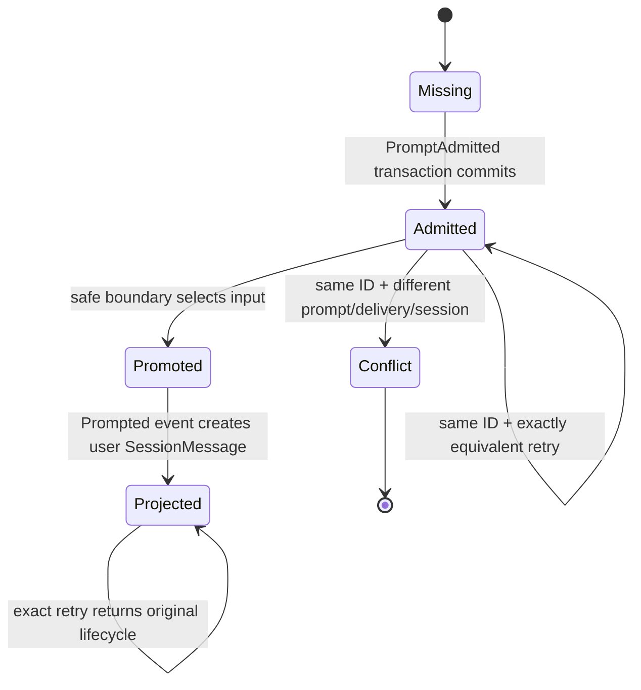
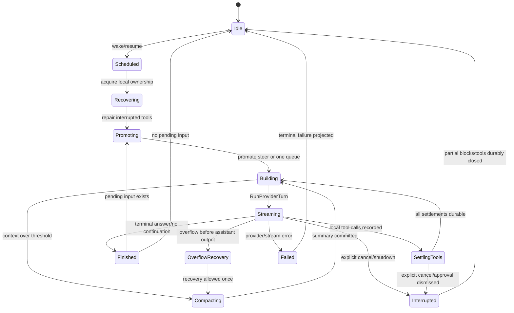
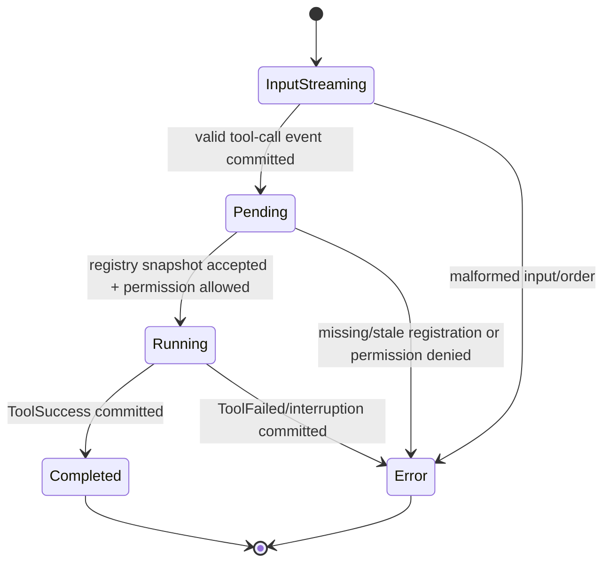

# 核心运行时、状态机与执行链详细设计

> 状态：V2-only 设计草案，供评审。本文中的“源码事实”来自 `dev@89130db6b0060a345548d870c51132ee71d6a828`；“目标设计”和示范代码不是已经实现的代码。

## 1. 本文解决什么问题

主计划已经确定 Go 是权威状态拥有者、Tier-1 Provider 进程内运行，Python 只承担可选 integration。本文继续回答实现团队真正开始编码时会遇到的问题：

1. Prompt 为什么必须先落库再唤醒 Runner？
2. `steer`、`queue`、Provider Turn、Tool settlement 怎样组成一个不会重复执行的状态机？
3. Event、Projector 和业务表应该在哪一个事务里更新？
4. 中断、Go Provider/MCP/Python connector 故障、Go 进程重启后从哪里继续？
5. Go 的核心接口、结构体和循环大致长什么样？

生活化比喻：Session 像一条有编号的生产线。Prompt 是先登记入库的订单，Event Log 是不可涂改的流水账，Projector 是实时更新的看板，Runner 是按订单驱动生产的班组。Go Provider 是厂内标准工位；Python Wiki/文档/SaaS connector 是按需叫来的专用外协工具，只能接收批准后的工单并返回结果，不能修改仓库账本或指挥生产线。

## 2. 上游事实基线

### 2.1 已证实的关键事实

- `SessionV2.prompt` 默认把 delivery 设为 `steer`，调用 `SessionInput.admit`，只有 admission 成功后才调用 `execution.wake`：[session.ts](/Users/zhanghongze/PycharmProjects/opencode/packages/core/src/session.ts#L360)。
- `SessionInput` 用 `admitted_seq` 和 `promoted_seq` 表示“已接收但未进入 transcript”与“已提升”的生命周期：[sql.ts](/Users/zhanghongze/PycharmProjects/opencode/packages/core/src/session/sql.ts#L140)。
- `steer` 在捕获的 aggregate cutoff 之前批量提升，`queue` 每次只取最早的一个：[input.ts](/Users/zhanghongze/PycharmProjects/opencode/packages/core/src/session/input.ts#L245)。
- 同 Session 由 `SessionRunCoordinator` 合并 wake/join，不同 Session 可以并行：[run-coordinator.ts](/Users/zhanghongze/PycharmProjects/opencode/packages/core/src/session/run-coordinator.ts#L24)。
- V2 Runner 每个 Provider Turn 调用一次 `llm.stream(request)`；Tool Call 先持久化，再执行，再持久化 settlement，然后重载历史进入下一 turn：[llm.ts](/Users/zhanghongze/PycharmProjects/opencode/packages/core/src/session/runner/llm.ts#L205)。
- Durable Event、同步 Projector、业务 commit hook、aggregate sequence 和 event row 在同一个 immediate transaction 内完成；commit 后才通知订阅者：[event.ts](/Users/zhanghongze/PycharmProjects/opencode/packages/core/src/event.ts#L205)。
- text/reasoning/tool-input delta 是 live-only，终态 block/tool/step 事件是 durable：[session-event.ts](/Users/zhanghongze/PycharmProjects/opencode/packages/schema/src/session-event.ts#L198)。
- 上游 Runner 仍明确缺少集群级 durable ownership、完整 busy/retry 状态和 stale attachment fencing；复刻版不得把这些 TODO 描述成上游已有行为：[llm.ts](/Users/zhanghongze/PycharmProjects/opencode/packages/core/src/session/runner/llm.ts#L43)。

### 2.2 V2-only 目标设计相对上游的选择

- 第一版保持 canonical V2 的“单 Go 进程、单 SQLite writer、进程内 Session ownership”。
- `session_run_projection`、`tool_call_projection` 等目标版附加表只能是 Event 可重建投影，不成为第二份权威事实。
- Provider adapter（Go 简化直连/RPC）与 Python Provider（RPC）都不接收数据库连接、不执行 Tool、不持久化 Session checkpoint。
- Tool Call 不做反向 Provider RPC：Provider 流出 `tool_call` 后结束/完成本 turn；Go 结算工具，再发起下一次完整 Provider Turn。
- Python MCP connector 只能作为 Tool execution leaf；ToolCalled、Permission、terminal settlement 和 continuation 全部留在 Go。
- 目标运行时只有 `Session + Execution + Coordinator + Runner`；禁止引入 `SessionPrompt`、`SessionProcessor` 或第二套 loop。
- 只写 canonical `session/session_input/session_message/context_epoch` 投影；不建立 legacy `message/part` 双写路径。
- Session 创建必须发布目标版 `SessionCreated` durable Event 并由 Projector 建立 `session` 行；禁止沿用上游迁移期的 `SessionV1.Event.Created`。

## 3. 权威对象与关联

```text
Project 1 ────── * Session 1 ────── * DurableEvent
   │                 │  │                 │
   │                 │  ├──── * SessionInput
   │                 │  ├──── * SessionMessage
   │                 │  ├──── 0..1 ContextEpoch
   │                 │  └──── * Child Session(parent_id)
   │                 │
   ├──── * SavedPermission          DurableEvent
   └──── * Workspace               ├─ 权威历史
                                    └─ 同步驱动 Projector

Python Integration（P7 MCP；P14+ 可选长尾 Provider RPC）
   ├─ MCP Tool 只看批准后的 Tool args/capability lease
   └─ Provider Worker 只看 ProviderTurnRequest 快照，不拥有上述任何对象
```

| 对象 | 权威来源 | 可重建投影 | 谁可写 | 删除语义 |
|---|---|---|---|---|
| Session 创建/切换/Prompt/Tool/Compaction | `event` | `session`、`session_message`、`session_input` | Go Event Store | 删除 aggregate 后级联/重建 |
| Prompt inbox | `PromptAdmitted` Event | `session_input` | Go Projector | Session 删除级联 |
| 可见 transcript | Durable Session Event | `session_message` | Go Projector | 可按 Event replay 重建 |
| Permission 永久批准 | Permission command | `permission` | Go Permission service | Project 删除级联 |
| Provider stream delta | 内存 live event | 无 | Go broadcast | 断线后不保证重放 |
| Provider transport cache | adapter 有界内存 | 无 | Go 简化直连/RPC adapter | 进程重启即丢失，不影响 durable state |
| Python connector cache | connector 有界内存 | 无 | 可选 Python MCP server | connector 重启即丢失，不得成为 Tool 真相 |

## 4. Prompt 输入状态机



### 4.1 必须保持的输入不变量

1. `message_id` 全局唯一；不能跨 Session 复用。
2. admission 已 commit、wake 尚未发生时，数据仍可由 `resume` 或下次启动恢复。
3. `admitted_seq` 是该 Session aggregate sequence，不是数据库全局自增号。
4. `promoted_seq IS NULL` 才是 pending；提升必须在发布 `Prompted` 的同一事务写回。
5. `steer` 只批量提升本次捕获 cutoff 之前的输入，防止读取过程中新增的 steer 被意外吞入同一边界。
6. `queue` 每个外层 drain 只提升一个，随后可以提升 cutoff 内的 steer；不能一次清空全部 queue。

## 5. Session Runner 状态机

Runner 的进程内控制状态和 durable 业务状态必须分开：前者决定“现在有没有 goroutine 在跑”，后者决定“重启后历史是什么”。



### 5.1 外层 drain 与内层 turn

- 外层 drain：决定是否有 `steer/queue/force`，并在一个 Session 的本地 ownership 内持续消费。
- 内层 turn：构建一个不可变的 Provider request 快照，调用一次 `ProviderPort`，处理这一条流，等待本 turn 已启动的 Tool（Go built-in 或可选 MCP executor）全部结算。
- Tool settlement 引起的 continuation 不重新提升 queue；只有当前 continuation 结束后，外层 drain 才重新检查 inbox。
- 新 steer 在 Provider streaming 期间只能先 durable admit；安全边界到来后被下一 inner turn 提升。

## 6. Tool 状态机

上游 Message schema 中 Tool State 为 `pending | running | completed | error`：[session-message.ts](/Users/zhanghongze/PycharmProjects/opencode/packages/schema/src/session-message.ts#L82)。目标版保持公开状态，同时在实现中增加 generation 与 owning assistant message 检查。



关键不变量：

- Side effect 开始前，`Tool.Called` 必须已 durable commit。
- Tool execution 使用“Provider Turn 开始时捕获的 registry generation”；名称相同但注册已被替换时拒绝新调用，已捕获并开始的调用允许完成。
- `(session_id, assistant_message_id, call_id)` 唯一标识一次 settlement；相同 `call_id` 在不同 assistant message 中可以合法出现。
- 任意退出路径都要把 `pending/running` 转成 `completed/error`；进程重启的第一步扫描并关闭遗留状态。
- provider-executed tool 不由 Go 重复执行，但仍需要持久化其 provider result/错误。

## 7. Permission 状态机

```text
Tool leaf asks(action, resource, session, agent)
    │
    ├─ ordered rules last-match = allow ───────────────► execute
    ├─ ordered rules last-match = deny ────────────────► durable ToolFailed / correction
    └─ ask
        ├─ reply once ─────────────────────────────────► execute once
        ├─ reply always ──► save(project, action, resource) ─► execute
        ├─ reject ─────────────────────────────────────► decline/interruption policy
        └─ context cancel ─────────────────────────────► remove pending waiter
```

Saved allow 不能覆盖配置中的显式 deny。Permission Service 返回的是 typed decision/error；UI reply 是外部事件，不能让 Tool goroutine直接修改数据库。

## 8. 完整调用链图

```text
┌──────────────────────────── 入口层 ────────────────────────────┐
│ HTTP POST /api/session/:id/prompt / CLI / TUI / ACP            │
└───────────────────────────────┬─────────────────────────────────┘
                                ▼
┌────────────────────── Prompt Command Handler ──────────────────┐
│ 校验 Session → 解析附件 MIME → 生成/校验 message_id             │
└───────────────────────────────┬─────────────────────────────────┘
                                ▼
┌──────────────────── BEGIN IMMEDIATE 事务 ──────────────────────┐
│ PromptAdmitted Event → 分配 aggregate seq → Projector 写 inbox │
│ → 更新 event_sequence → 插入 event → COMMIT                    │
└───────────────────────────────┬─────────────────────────────────┘
                                ▼ commit 后
┌──────────────────── SessionRunCoordinator ─────────────────────┐
│ 同 Session join/coalesce；不同 Session 并行；wake 仅是建议通知  │
└───────────────────────────────┬─────────────────────────────────┘
                                ▼
┌────────────────────── Go Session Runner ───────────────────────┐
│ 修复遗留工具 → 提升 steer/queue → 重载投影历史 → 选 Agent/Model │
│ → Context Epoch → Tool Registry snapshot → 构造 ProviderTurn   │
└───────────────────────────────┬─────────────────────────────────┘
                                ▼ ProviderPort stream
┌──────────────────── Go Tier-1 Provider Adapter ────────────────┐
│ 请求投影 → Auth/HTTP/SSE → Provider framing → canonical LLMEvent│
└───────────────────────────────┬─────────────────────────────────┘
                                ▼
┌────────────────────── LLMEvent Publisher ──────────────────────┐
│ delta: live broadcast                                           │
│ start/end/call/error/finish: durable Event + Projector          │
└──────────────────┬─────────────────────────────┬───────────────┘
                   │ tool-call                   │ terminal text
                   ▼                             ▼
┌──────────────────────────────┐    ┌─────────────────────────────┐
│ Go Registry + Permission     │    │ Step/Assistant terminal     │
│ durable call → Go built-in   │    │ snapshot/diff/usage         │
│ 或 MCP/Python → durable终态  │    └──────────────┬──────────────┘
└───────────────┬──────────────┘                   │
                └──────────────┬───────────────────┘
                               ▼
┌──────────────────── Continuation Decision ─────────────────────┐
│ tool result? → 新 Provider Turn；pending steer/queue? → 提升；  │
│ overflow? → 最多一次 compaction recovery；否则 idle/failed      │
└─────────────────────────────────────────────────────────────────┘
```

> **ADR-0001：** 图中“Provider Adapter”在首个闭环使用进程内 fake，P5 使用三种 Go Tier-1 adapters。P14+ 只有真实长尾需求和独立 ADR 时才可增加 RPC → Python Worker；Runner 与下游状态机不感知实现差异。

## 9. Go 核心结构体草案

### 9.1 Domain 类型

```go
// 设计草案：internal/session/domain.go
package session

import "time"

type ID string
type MessageID string

type Delivery string

const (
	DeliverySteer Delivery = "steer"
	DeliveryQueue Delivery = "queue"
)

// Session 是对外可读投影，不直接承载正在运行的 goroutine/fiber。
type Session struct {
	ID          ID
	ProjectID   string
	WorkspaceID *string
	ParentID    *ID
	Directory   string
	Title       string
	Agent       *string
	Model       *ModelSelection
	CreatedAt   time.Time
	UpdatedAt   time.Time
}

type ModelSelection struct {
	ProviderID string
	ModelID    string
	Variant    string // 空字符串表示默认 variant；wire 层仍区分 absent。
}

// AdmittedInput 是 inbox 投影；PromotedSeq=nil 才表示待提升。
type AdmittedInput struct {
	MessageID   MessageID
	SessionID   ID
	Prompt      Prompt
	Delivery    Delivery
	AdmittedSeq int64
	PromotedSeq *int64
	CreatedAt   time.Time
}

type Prompt struct {
	Parts []PromptPart
}

// PromptPart 在真正实现时由 protobuf oneof 生成的 domain adapter 构造。
type PromptPart struct {
	Kind     string
	Text     string
	URI      string
	MIME     string
	Filename string
}
```

逻辑说明：`Session` 是可重建读模型；运行状态属于 Coordinator。`AdmittedInput` 的两个 sequence 使幂等、FIFO 和安全边界都可由 SQL 验证。Domain 不保存 JSON raw bytes，codec 只存在 repository/wire 边界。

### 9.2 核心 Port

```go
// 设计草案：internal/session/ports.go
package session

import "context"

type EventStore interface {
	Publish(ctx context.Context, cmd PublishCommand) (DurableEvent, error)
	ReadAfter(ctx context.Context, aggregateID string, after int64, limit int) ([]DurableEvent, error)
	SubscribeDurable(ctx context.Context, aggregateID string, after int64) (<-chan DurableEvent, error)
}

type SessionRepository interface {
	Get(ctx context.Context, id ID) (Session, error)
	Context(ctx context.Context, id ID) ([]Message, error)
	FindInput(ctx context.Context, id MessageID) (AdmittedInput, bool, error)
	HasPending(ctx context.Context, id ID, delivery Delivery) (bool, error)
}

type Execution interface {
	Wake(id ID)       // advisory；不能把成功 wake 当成持久化成功。
	Resume(ctx context.Context, id ID) error
	Interrupt(id ID)
	Active() []ID
}

type ProviderPort interface {
	RunTurn(ctx context.Context, req ProviderTurnRequest, sink LLMEventSink) error
}

type ToolRegistry interface {
	Snapshot(ctx context.Context, scope ToolScope) (ToolCatalogSnapshot, error)
	Settle(ctx context.Context, call RecordedToolCall, snapshot ToolCatalogSnapshot) (ToolSettlement, error)
}
```

## 10. Prompt admission 示范代码

```go
// 设计草案：internal/session/service.go
func (s *Service) Prompt(ctx context.Context, in PromptCommand) (AdmittedInput, error) {
	// 1. 先确认 Session 存在；NotFound 与 ID conflict 必须是不同错误。
	if _, err := s.sessions.Get(ctx, in.SessionID); err != nil {
		return AdmittedInput{}, err
	}

	messageID := in.MessageID
	if messageID == "" {
		messageID = s.ids.NewMessageID()
	}
	delivery := in.Delivery
	if delivery == "" {
		delivery = DeliverySteer
	}

	// 2. Publish 内部开启 BEGIN IMMEDIATE；Projector 在相同事务写 session_input。
	event, err := s.events.Publish(ctx, PublishCommand{
		ID:          s.ids.NewEventID(),
		AggregateID: string(in.SessionID),
		Type:        "session.next.prompt.admitted",
		Data: PromptAdmitted{
			SessionID: in.SessionID,
			MessageID: messageID,
			Prompt:    in.Prompt,
			Delivery:  delivery,
		},
	})
	if err != nil {
		// Event ID、message ID 或生命周期冲突会在这里成为 typed conflict。
		return AdmittedInput{}, mapPromptError(err)
	}

	admitted, ok, err := s.sessions.FindInput(ctx, messageID)
	if err != nil || !ok {
		return AdmittedInput{}, invariantError("admitted input projection missing")
	}

	// 3. 同 ID retry 只能在所有业务字段完全等价时返回原 admission。
	if !Equivalent(admitted, in.SessionID, messageID, in.Prompt, delivery) {
		return AdmittedInput{}, PromptConflictError{SessionID: in.SessionID, MessageID: messageID}
	}

	// 4. wake 发生在 commit 后；即使进程此刻崩溃，inbox 仍可被后续 resume 找到。
	if in.Resume {
		s.execution.Wake(in.SessionID)
	}
	_ = event // 用于 trace/metrics，不作为 wake 成功的前提。
	return admitted, nil
}
```

讨论点：`Resume` 在 HTTP 默认值层应为 `true`，不能依赖 Go `bool` 零值；建议 command 使用 `*bool` 或在 codec 层补默认值。

## 11. Event publish 示范代码

```go
// 设计草案：internal/event/store.go
func (s *Store) Publish(ctx context.Context, cmd PublishCommand) (DurableEvent, error) {
	var committed DurableEvent
	err := s.writer.Immediate(ctx, func(q Querier) error {
		// 1. 读取当前 aggregate sequence；不存在时从 -1 开始。
		latest, owner, err := q.GetSequence(ctx, cmd.AggregateID)
		if err != nil && !errors.Is(err, sql.ErrNoRows) {
			return err
		}
		next := latest + 1

		// 2. event_id 全局唯一；不能让同一 ID 出现在另一个 aggregate/seq。
		if pos, found, err := q.FindEventPosition(ctx, cmd.ID); err != nil {
			return err
		} else if found {
			return EventIDConflictError{ID: cmd.ID, Existing: pos}
		}

		committed = DurableEvent{
			ID: cmd.ID, AggregateID: cmd.AggregateID, Seq: next,
			Type: cmd.Type, Version: cmd.Version, Data: cmd.Data,
		}

		// 3. Projector 与可选业务 commit hook 共用当前 q/事务。
		// 任意 projector 失败都会回滚 sequence、event 和全部投影。
		if err := s.projectors.Apply(ctx, q, committed); err != nil {
			return err
		}
		if cmd.Commit != nil {
			if err := cmd.Commit(ctx, q, next); err != nil {
				return err
			}
		}

		// 4. 先保证 sequence parent row 存在，再插 event，满足 FK。
		if err := q.UpsertSequence(ctx, cmd.AggregateID, next, owner); err != nil {
			return err
		}
		return q.InsertEvent(ctx, committed)
	})
	if err != nil {
		return DurableEvent{}, err
	}

	// 5. 只有 COMMIT 成功后才 wake durable readers 与 live observers。
	s.durableWake.Notify(cmd.AggregateID)
	s.observers.Publish(committed)
	return committed, nil
}
```

生产实现还必须包含上游 replay 的 exact retry、owner claim/fence 和 version decoder；上面只展示新 Event 主路径。

## 12. Runner 主循环示范代码

```go
// 设计草案：internal/session/runner.go
func (r *Runner) Drain(ctx context.Context, sessionID ID, force bool) error {
	// Coordinator 保证同一个 sessionID 不会并行进入本函数。
	if err := r.recoverInterruptedTools(ctx, sessionID); err != nil {
		return err
	}

	for {
		hasSteer, err := r.inputs.HasPending(ctx, sessionID, DeliverySteer)
		if err != nil { return err }
		hasQueue := false
		if !hasSteer {
			hasQueue, err = r.inputs.HasPending(ctx, sessionID, DeliveryQueue)
			if err != nil { return err }
		}
		if !force && !hasSteer && !hasQueue {
			return nil
		}

		promotion := choosePromotion(hasSteer, hasQueue)
		step := 1
		for needsContinuation := true; needsContinuation; step++ {
			result, err := r.runTurn(ctx, sessionID, promotion, step)
			if err != nil {
				return err
			}
			promotion = "" // Tool continuation 不应重复提升 queue。
			needsContinuation = result.NeedsContinuation
		}

		// 一轮用户输入链完成后再回外层重新检查 inbox。
		force = false
	}
}

func (r *Runner) runTurn(ctx context.Context, id ID, promotion Delivery, step int) (TurnResult, error) {
	if err := r.inputs.PromoteAtSafeBoundary(ctx, id, promotion); err != nil {
		return TurnResult{}, err
	}

	session, messages, epoch, tools, model, err := r.buildTurnSnapshot(ctx, id)
	if err != nil { return TurnResult{}, err }
	if compacted, err := r.compactor.CompactIfNeeded(ctx, session, messages, model); err != nil {
		return TurnResult{}, err
	} else if compacted {
		return r.runTurn(ctx, id, "", step) // 新历史快照，step 不增加。
	}

	req := BuildProviderTurnRequest(session, messages, epoch, tools, model, step)
	frames, err := r.provider.RunTurn(ctx, req)
	if err != nil { return TurnResult{}, err }

	state := NewTurnPublisher(id, tools.Generation)
	for frame := range frames {
		if err := state.Validate(frame); err != nil {
			return TurnResult{}, err
		}
		if err := r.handleFrame(ctx, state, frame, tools); err != nil {
			return TurnResult{}, err
		}
	}

	// Provider stream 结束后先等待本 turn 启动的工具，再决定 continuation。
	if err := state.AwaitSettlements(ctx); err != nil {
		return TurnResult{}, err
	}
	if err := state.ClosePartialBlocks(ctx); err != nil {
		return TurnResult{}, err
	}
	return TurnResult{NeedsContinuation: state.HasLocalToolResult()}, nil
}
```

最容易写错的地方是：递归 compaction 不能消耗 agent step；Tool continuation 要增加 step；新 steer promotion 后重置上游配置的 step allowance；第二次 overflow 不允许无限递归。

## 13. Frame 处理示范代码

```go
// 设计草案：internal/session/llm_event_publisher.go
func (r *Runner) handleFrame(
	ctx context.Context,
	turn *TurnPublisher,
	frame ProviderTurnFrame,
	catalog ToolCatalogSnapshot,
) error {
	switch event := frame.Event.(type) {
	case TextDelta, ReasoningDelta, ToolInputDelta:
		// delta 只做 live broadcast；断线客户端从 durable block-end 恢复。
		return r.live.Publish(ctx, turn.SessionID(), event)

	case TextStarted, TextEnded, ReasoningStarted, ReasoningEnded:
		return r.publishSessionBlock(ctx, turn, event)

	case ToolCall:
		// publishSessionToolCalled 成功后，才允许 goroutine 进入实际副作用。
		recorded, err := r.publishSessionToolCalled(ctx, turn, event, catalog.Generation)
		if err != nil { return err }
		return turn.StartTool(func(toolCtx context.Context) error {
			settlement := r.tools.Settle(toolCtx, recorded, catalog)
			return r.publishToolSettlement(toolCtx, recorded, settlement)
		})

	case ProviderError:
		return r.publishProviderError(ctx, turn, event)

	case Finish:
		return r.publishStepFinished(ctx, turn, event)

	default:
		return UnsupportedLLMEventError{Type: frame.TypeName()}
	}
}
```

## 14. 崩溃与恢复算法

### 14.1 Go 启动恢复

1. 完成 SQLite migration 和 `PRAGMA integrity_check/foreign_key_check`。
2. 从 Event projection 查询 `pending/running` Tool；发布 typed `Tool.Failed(reason=process_restarted)`，不能直接 UPDATE 为 error。
3. 查询 `session_input.promoted_seq IS NULL` 的 Session，放入 bounded recovery queue。
4. 对每个 Session 调用 `Wake`；Coordinator 去重。
5. 清理过期 Provider/integration operational attempt、MCP child、PTY ticket、OAuth callback waiter 等非业务状态。

### 14.2 Provider 或 Python Integration 崩溃

| 崩溃时点 | Go 已有 durable 输出 | 默认动作 |
|---|---|---|
| Go Provider 建连前/首 event 前 | 否 | 按 Runner retry policy 可重试同一逻辑 request |
| text/reasoning started 后 | 是 | durable close partial block，记录 provider transport failure，不透明重试 |
| ToolCalled durable 前 | 否 | 此 call 不存在；turn 失败 |
| ToolCalled durable 后、executor 未启动 | 是 | 恢复扫描把遗留 Tool 标失败；下一 resume 可继续 |
| Go built-in Tool 正在执行 | 是 | 等待/取消并 durable settle；绝不因进程恢复重复执行 |
| Python MCP Tool 正在执行 | 是 | cancel/关闭 transport/必要时 kill；durable settle typed failure，默认不重试副作用 |
| Python Provider（RPC）首 frame 前 | 否 | supervisor 可重启；是否重发仍由 Go Runner policy 决定 |
| finish 已 durable | 是 | turn 已完成；忽略迟到的 transport error |

### 14.3 显式 interrupt

- `Execution.Interrupt` 只取消 active Session run，不删除已 admit 的 inbox。
- Provider HTTP context、MCP call/可选 RPC context、Go Tool context 同时收到取消。
- Tool 取消超时后，进程型工具执行 kill escalation；无法强制取消的外部 MCP/Provider 调用仍要记录不确定结果。
- Publisher 在退出前持久化 partial block end、unsettled tool failure 和 assistant step failure/interrupted。

## 15. 并发模型

| 层级 | 并发策略 | 上限来源 | 保护对象 |
|---|---|---|---|
| SQLite writer | 串行/`BEGIN IMMEDIATE` | 1 | sequence + event + projectors |
| Session drains | key-based singleflight | Config/CPU | 每 Session 仅一个；跨 Session 并行 |
| Provider turns | bounded semaphore | Config/Provider quota | Go HTTP/RPC；Python/连接/费用 |
| 同 turn local tools | eager + bounded group | Agent/Tool policy | 文件冲突、进程数 |
| MCP connections | server-scoped lifecycle | Config | transport/OAuth/token |
| SSE subscribers | 每连接 bounded queue | server config | 慢客户端隔离 |

即使 Tool 可以并发，文件写工具仍需按 workspace mutation lock 或 snapshot policy串行，否则 Event 顺序相同但文件最终状态可能不确定。

## 16. 可执行测试清单

| 不变量 | 上游测试依据 | 复刻测试 |
|---|---|---|
| exact prompt retry/冲突 | `core/test/session-prompt.test.ts:252,292,317` | table-driven + 100 并发相同 ID |
| steer cutoff/queue FIFO | `core/test/session-prompt.test.ts:386`、`session-runner.test.ts:1987` | deterministic scheduler + randomized model |
| 同 Session join/跨 Session 并行 | `session-run-coordinator.test.ts:9,372` | race detector + virtual clock |
| Event/Projector 原子性 | `core/test/event.test.ts:175,192,225` | 每个 SQL 边界 fault injection |
| 慢订阅者隔离 | `core/test/event.test.ts:323` | capacity=1，快慢订阅并行 |
| Tool 先记录后副作用 | `session-runner.test.ts:1623` | tool hook 读取 DB 断言 Called 已存在 |
| 中断后无 running Tool | `session-runner.test.ts:2844,2917` | cancel 每个生命周期边界 |
| overflow 最多恢复一次 | `session-runner.test.ts:1148,1177` | 两次 overflow cassette |
| partial delta 终态关闭 | `session-runner.test.ts:3300` | disconnect/interrupt/property test |

## 17. 评审时必须讨论的问题

1. 初版是否严格保持 canonical V2 的“进程内 ownership”，还是提前加入 `session_run_projection` 和 lease？建议保持单进程，lease 作为后续能力，否则会同时扩大协议和恢复语义。
2. Tool 并发默认值是上游无界语义、固定上限还是按 Tool class？建议直接选定一个有界 production policy 并记录差异，不维护 compatibility profile。
3. `resume=false` 的 Prompt 是否应由后台恢复扫描自动 wake？答案应为否；恢复扫描只处理曾经计划执行或由显式 resume 触发的输入，需要额外 durable intent 才能区分。
4. delta 是否需要落盘以支持无损 UI reconnect？canonical V2 冻结版本是 live-only。若目标版新增 delta journal，必须是独立可选能力，不能改变公开 durable Event stream。
5. 外部 Tool/MCP 被取消时“结果未知”如何表达？建议 typed `indeterminate` 内部原因映射为公开 Tool error，同时禁止自动重试有副作用调用。

## 18. 本设计的完成门槛

- 所有状态转换都有唯一 command/event 入口，没有业务代码直接 UPDATE 越过 Event。
- Event transaction、Prompt admission、Tool settlement、interrupt/recovery 示例均被真正实现的测试替代。
- Go race detector、SQLite fault injection、Go Provider failure 和启用 profile 时的 Python MCP/Worker crash suite 全绿。
- 对照 canonical V2 测试的每个差异都有明确 V2 scope decision，未决定项保持 `pending`；V1-only 行为不进入完成门槛。
