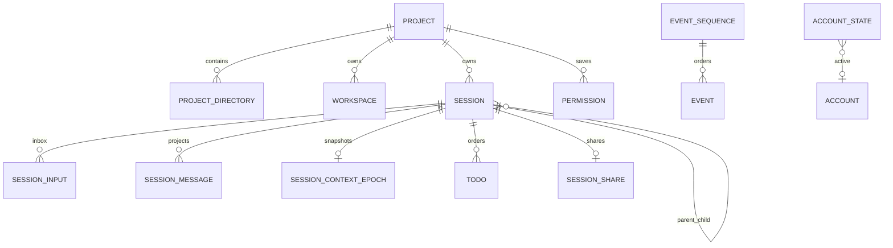

# SQLite、表结构、索引与迁移详细设计

> 状态：V2-only 设计草案，供评审。DDL 以冻结上游 canonical Session/Event Schema 为行为依据，只设计目标 V2 表与内部附加表；不复制迁移期 legacy 表。本文件不是已经执行的 migration。

## 1. 结论先行

目标版只允许 Go 写 SQLite。Event Log 是 Session 的权威历史；`session`、`session_input`、`session_message`、`session_context_epoch`、`todo` 等是 canonical 同步投影。一次 command 的 Event、aggregate sequence 和全部 Projector 更新必须在一个 `BEGIN IMMEDIATE` 事务里提交。

SQLite 不是 Provider adapter、MCP server 或 Python Integration 的 checkpoint。Go Provider 故障或可选 Python connector/Worker 崩溃后，Go 只依据 Event/投影决定失败、重试或重建请求，不向外部 runtime 查询业务真相。

## 2. 上游真实 Schema 证据

- 当前生成 DDL 共包含 `workspace/account/credential/event/permission/project/message/part/session_* /todo/share` 等表：[schema.gen.ts](/Users/zhanghongze/PycharmProjects/opencode/packages/core/src/database/schema.gen.ts#L7)。
- `event_sequence(aggregate_id, seq, owner_id)` 与 `event(id, aggregate_id, seq, type, data)` 的真实定义：[event/sql.ts](/Users/zhanghongze/PycharmProjects/opencode/packages/core/src/event/sql.ts#L4)。
- 当前 Event 唯一索引是 `(aggregate_id, seq)`，另有 `(aggregate_id, type, seq)` 读取索引：[schema.gen.ts](/Users/zhanghongze/PycharmProjects/opencode/packages/core/src/database/schema.gen.ts#L239)。
- `session_input` 保存 `prompt/delivery/admitted_seq/promoted_seq`，有 pending、admitted、promoted 三类索引：[session/sql.ts](/Users/zhanghongze/PycharmProjects/opencode/packages/core/src/session/sql.ts#L140)。
- 新 `session_message` 以 `(session_id, seq)` 唯一排序；上游仍并存的 legacy `message/part` 是迁移事实，但不进入目标 DDL：[session/sql.ts](/Users/zhanghongze/PycharmProjects/opencode/packages/core/src/session/sql.ts#L68)。
- `session_context_epoch` 保存 baseline、typed snapshot 和 baseline sequence：[session/sql.ts](/Users/zhanghongze/PycharmProjects/opencode/packages/core/src/session/sql.ts#L168)。
- 上游迁移曾删除 pre-launch 投影，因为它们无法分配真实 aggregate order；这说明 sequence 不是可事后猜测的时间戳：[20260603040000_session_message_projection_order.ts](/Users/zhanghongze/PycharmProjects/opencode/packages/core/src/database/migration/20260603040000_session_message_projection_order.ts#L8)。

## 3. 数据库角色划分

| 类别 | 表 | 是否权威 | 能否 replay 重建 | 写入口 |
|---|---|---|---|---|
| Migration | `schema_migration`、`data_migration` | 是 | 否 | migrator |
| Durable log | `event_sequence`、`event` | 是 | 自身即历史 | EventStore |
| Project/Workspace | `project`、`project_directory`、`workspace` | 是 | 部分 | Project service |
| Session projection | `session`、`session_input`、`session_message`、`session_context_epoch`、`todo` | Event 派生 | 是 | Projector |
| Security/account | `account`、`account_state`、`control_account`、`credential` | 是 | 否 | Auth/Credential service |
| Permission/share | `permission`、`session_share` | 是/外部同步状态 | 部分 | Permission/Share service |
| 目标内部附加 | `content_blob`、`runtime_attempt` | 前者内容权威；后者仅 operational | 视表而定 | Blob/Go runtime supervisor |

## 4. ER 关系图



注意：`event.aggregate_id` 在数据库层只关联 `event_sequence`，不会直接 FK 到 `session.id`，因为 Event Store 需要支持其他 aggregate。`session.parent_id` 当前上游也没有 self-FK，便于迁移/导入乱序 child；应用层负责完整性。

## 5. SQLite 连接与 PRAGMA

```sql
-- 设计草案：由 Go 在每个连接建立后设置。
PRAGMA foreign_keys = ON;
PRAGMA busy_timeout = 5000;
PRAGMA temp_store = MEMORY;

-- journal_mode 是数据库级设置，应在 migration/初始化阶段执行，不放入业务事务。
PRAGMA journal_mode = WAL;

-- 本地单机默认 NORMAL；需要断电级更强保证时允许配置 FULL，不能运行中静默变化。
PRAGMA synchronous = NORMAL;
```

### 5.1 连接池约束

- writer：一个独占 `*sql.Conn` 或单 writer goroutine，所有 durable command 通过它串行化。
- readers：有界 pool；每个 SSE replay 使用短查询，不长期持有 read transaction。
- migration、projector rebuild、database import 取得全局 fence，停止新 command 并等待 active writer 清空。
- 不把 `SQLITE_BUSY` 当普通 retry 无限循环；按有界 backoff 后返回 typed storage error。

## 6. Canonical V2 DDL

以下是首个 V2-only 数据库讨论稿。它只保留 canonical Domain、Event、投影与产品服务真正需要的表；`message`、`part`、Session V1 Event 投影和 Permission V1 JSON 不得加入 bootstrap。真正 migration 必须由版本化文件逐步创建，不能把整段作为唯一初始脚本后永不演进。

### 6.1 Migration、Project、Workspace

```sql
CREATE TABLE schema_migration (
  id              TEXT PRIMARY KEY,
  checksum        TEXT NOT NULL,
  time_applied    INTEGER NOT NULL
);

CREATE TABLE data_migration (
  name            TEXT PRIMARY KEY,
  time_completed  INTEGER NOT NULL
);

CREATE TABLE project (
  id                TEXT PRIMARY KEY,
  worktree          TEXT NOT NULL,
  vcs               TEXT,
  name              TEXT,
  icon_url          TEXT,
  icon_url_override TEXT,
  icon_color        TEXT,
  time_created      INTEGER NOT NULL,
  time_updated      INTEGER NOT NULL,
  time_initialized  INTEGER,
  sandboxes         TEXT NOT NULL, -- canonical JSON array of absolute paths
  commands          TEXT           -- canonical JSON object
);

CREATE TABLE project_directory (
  project_id    TEXT NOT NULL,
  directory     TEXT NOT NULL,
  type          TEXT,
  strategy      TEXT,
  time_created  INTEGER NOT NULL,
  PRIMARY KEY (project_id, directory),
  FOREIGN KEY (project_id) REFERENCES project(id) ON DELETE CASCADE
);

CREATE TABLE workspace (
  id            TEXT PRIMARY KEY,
  type          TEXT NOT NULL,
  name          TEXT NOT NULL DEFAULT '',
  branch        TEXT,
  directory     TEXT,
  extra         TEXT, -- canonical JSON
  project_id    TEXT NOT NULL,
  time_used     INTEGER NOT NULL,
  FOREIGN KEY (project_id) REFERENCES project(id) ON DELETE CASCADE
);

CREATE INDEX workspace_project_idx
  ON workspace(project_id);
```

讨论：上游生成 Schema 目前没有 `workspace_project_idx`，但 Project 删除有 FK cascade。目标版是否增加该索引属于物理优化，不改变公开语义；需用真实 query plan 决定。

### 6.2 Session 主表

```sql
CREATE TABLE session (
  id                   TEXT PRIMARY KEY,
  project_id           TEXT NOT NULL,
  workspace_id         TEXT,
  parent_id            TEXT,
  slug                 TEXT NOT NULL,
  directory            TEXT NOT NULL,
  path                 TEXT,
  title                TEXT NOT NULL,
  version              TEXT NOT NULL,
  share_url            TEXT,
  summary_additions    INTEGER,
  summary_deletions    INTEGER,
  summary_files        INTEGER,
  summary_diffs        TEXT, -- canonical JSON: FileDiff[]
  metadata             TEXT, -- canonical JSON object
  cost                 REAL NOT NULL DEFAULT 0,
  tokens_input         INTEGER NOT NULL DEFAULT 0,
  tokens_output        INTEGER NOT NULL DEFAULT 0,
  tokens_reasoning     INTEGER NOT NULL DEFAULT 0,
  tokens_cache_read    INTEGER NOT NULL DEFAULT 0,
  tokens_cache_write   INTEGER NOT NULL DEFAULT 0,
  revert               TEXT, -- canonical JSON: Revert.State
  agent                TEXT,
  model                TEXT, -- canonical JSON: providerID/id/variant
  time_created         INTEGER NOT NULL,
  time_updated         INTEGER NOT NULL,
  time_compacting      INTEGER,
  time_archived        INTEGER,
  FOREIGN KEY (project_id) REFERENCES project(id) ON DELETE CASCADE,
  FOREIGN KEY (workspace_id) REFERENCES workspace(id) ON DELETE SET NULL,
  FOREIGN KEY (parent_id) REFERENCES session(id) ON DELETE CASCADE
);

CREATE INDEX session_project_idx   ON session(project_id);
CREATE INDEX session_workspace_idx ON session(workspace_id);
CREATE INDEX session_parent_idx    ON session(parent_id);
```

V2-only 不需要接受违反目标不变量的 legacy 行，因此 `workspace_id/parent_id` 可以建立 FK。若 Session 创建顺序要求乱序导入，应由 canonical importer 在 staging 中拓扑排序或使用受控 deferred transaction，不能长期放弃完整性约束。

### 6.3 Durable Event Store

```sql
CREATE TABLE event_sequence (
  aggregate_id  TEXT PRIMARY KEY,
  seq           INTEGER NOT NULL,
  owner_id      TEXT
);

CREATE TABLE event (
  id            TEXT PRIMARY KEY,
  aggregate_id  TEXT NOT NULL,
  seq           INTEGER NOT NULL,
  type          TEXT NOT NULL, -- 包含/映射 definition version
  data          TEXT NOT NULL, -- canonical JSON payload
  FOREIGN KEY (aggregate_id)
    REFERENCES event_sequence(aggregate_id)
    ON DELETE CASCADE
);

CREATE UNIQUE INDEX event_aggregate_seq_idx
  ON event(aggregate_id, seq);

CREATE INDEX event_aggregate_type_seq_idx
  ON event(aggregate_id, type, seq);
```

不增加全局自增 Event rowid 作为公开 cursor。Session durable stream 的 cursor 是 aggregate `seq`；引入全局 cursor 会暗示不同 aggregate 之间存在权威总顺序，而上游契约没有该保证。

### 6.4 Prompt inbox 与 canonical Message 投影

```sql
CREATE TABLE session_input (
  id            TEXT PRIMARY KEY, -- 与 user message ID 相同
  session_id    TEXT NOT NULL,
  prompt        TEXT NOT NULL,    -- canonical JSON Prompt
  delivery      TEXT NOT NULL,
  admitted_seq  INTEGER NOT NULL,
  promoted_seq  INTEGER,
  time_created  INTEGER NOT NULL,
  FOREIGN KEY (session_id) REFERENCES session(id) ON DELETE CASCADE
);

CREATE INDEX session_input_session_pending_delivery_seq_idx
  ON session_input(session_id, promoted_seq, delivery, admitted_seq);

CREATE UNIQUE INDEX session_input_session_admitted_seq_idx
  ON session_input(session_id, admitted_seq);

CREATE UNIQUE INDEX session_input_session_promoted_seq_idx
  ON session_input(session_id, promoted_seq);

CREATE TABLE session_message (
  id            TEXT PRIMARY KEY,
  session_id    TEXT NOT NULL,
  type          TEXT NOT NULL,
  seq           INTEGER NOT NULL,
  time_created  INTEGER NOT NULL,
  time_updated  INTEGER NOT NULL,
  data          TEXT NOT NULL, -- encoded message excluding id/type
  FOREIGN KEY (session_id) REFERENCES session(id) ON DELETE CASCADE
);

CREATE UNIQUE INDEX session_message_session_seq_idx
  ON session_message(session_id, seq);

CREATE INDEX session_message_session_type_seq_idx
  ON session_message(session_id, type, seq);

CREATE INDEX session_message_session_time_created_id_idx
  ON session_message(session_id, time_created, id);

CREATE INDEX session_message_time_created_idx
  ON session_message(time_created);

CREATE TABLE session_context_epoch (
  session_id    TEXT PRIMARY KEY,
  baseline      TEXT NOT NULL,
  snapshot      TEXT NOT NULL, -- canonical JSON SystemContext.Snapshot
  baseline_seq  INTEGER NOT NULL,
  FOREIGN KEY (session_id) REFERENCES session(id) ON DELETE CASCADE
);
```

SQLite UNIQUE 对 `NULL` 允许多行，因此 `session_input_session_promoted_seq_idx` 不妨碍多个 pending row；一旦 `promoted_seq` 有值，同 Session 内必须唯一。

### 6.5 Todo、Permission、Share

```sql
CREATE TABLE todo (
  session_id    TEXT NOT NULL,
  content       TEXT NOT NULL,
  status        TEXT NOT NULL,
  priority      TEXT NOT NULL,
  position      INTEGER NOT NULL,
  time_created  INTEGER NOT NULL,
  time_updated  INTEGER NOT NULL,
  PRIMARY KEY (session_id, position),
  FOREIGN KEY (session_id) REFERENCES session(id) ON DELETE CASCADE
);

CREATE INDEX todo_session_idx ON todo(session_id);

CREATE TABLE permission (
  id            TEXT PRIMARY KEY,
  project_id    TEXT NOT NULL,
  action        TEXT NOT NULL,
  resource      TEXT NOT NULL,
  time_created  INTEGER NOT NULL,
  time_updated  INTEGER NOT NULL,
  FOREIGN KEY (project_id) REFERENCES project(id) ON DELETE CASCADE
);

CREATE UNIQUE INDEX permission_project_action_resource_idx
  ON permission(project_id, action, resource);

CREATE TABLE session_share (
  session_id    TEXT PRIMARY KEY,
  id            TEXT NOT NULL,
  secret        TEXT NOT NULL,
  url           TEXT NOT NULL,
  time_created  INTEGER NOT NULL,
  time_updated  INTEGER NOT NULL,
  FOREIGN KEY (session_id) REFERENCES session(id) ON DELETE CASCADE
);
```

`message`、`part` 表明确不创建。所有可见 transcript 只进入 `session_message`，消息内部 block/part 使用 canonical tagged union 编码；若未来为查询性能拆分内容表，必须仍由 canonical Event 可重建且不得恢复 V1 双写。

### 6.6 Account 与 Credential

```sql
CREATE TABLE account (
  id             TEXT PRIMARY KEY,
  email          TEXT NOT NULL,
  url            TEXT NOT NULL,
  credential_ref TEXT NOT NULL, -- keychain://... 或 encrypted://...
  time_created   INTEGER NOT NULL,
  time_updated   INTEGER NOT NULL
);

CREATE TABLE account_state (
  id                 INTEGER PRIMARY KEY,
  active_account_id  TEXT,
  active_org_id      TEXT,
  FOREIGN KEY (active_account_id) REFERENCES account(id) ON DELETE SET NULL
);

CREATE TABLE control_account (
  email          TEXT NOT NULL,
  url            TEXT NOT NULL,
  credential_ref TEXT NOT NULL,
  active         INTEGER NOT NULL,
  time_created   INTEGER NOT NULL,
  time_updated   INTEGER NOT NULL,
  PRIMARY KEY (email, url)
);

CREATE TABLE credential (
  id              TEXT PRIMARY KEY,
  integration_id  TEXT,
  label           TEXT NOT NULL,
  value_ref       TEXT NOT NULL, -- 禁止明文 secret
  connector_id    TEXT,
  method_id       TEXT,
  active          INTEGER,
  time_created    INTEGER NOT NULL,
  time_updated    INTEGER NOT NULL
);
```

安全决策：不追求上游 credential 表的物理兼容。目标新建 credential 默认保存 `keychain://...` 引用或经批准的加密 envelope，禁止把明文 token 作为兼容代价写入业务 DB。可选导入器若读取明文，只能在内存中立即写入安全存储并清除缓冲。

## 7. 目标版内部附加表

这些表不出现在公开 API，名称加 `_replica_` 前缀，避免和上游未来迁移冲突。

### 7.1 大内容与媒体

```sql
CREATE TABLE _replica_content_blob (
  digest         TEXT PRIMARY KEY, -- sha256:<hex>
  media_type     TEXT NOT NULL,
  byte_length    INTEGER NOT NULL,
  storage_kind   TEXT NOT NULL,    -- inline/file
  inline_data    BLOB,
  relative_path  TEXT,
  ref_count      INTEGER NOT NULL DEFAULT 0,
  time_created   INTEGER NOT NULL,
  CHECK (
    (storage_kind = 'inline' AND inline_data IS NOT NULL AND relative_path IS NULL)
    OR
    (storage_kind = 'file' AND inline_data IS NULL AND relative_path IS NOT NULL)
  )
);
```

Event/Message JSON 只保存 digest/media metadata。文件写入采用“临时文件 fsync → 原子 rename → DB 引用事务”；GC 只能清理 `ref_count=0` 且超过 grace period 的 blob。是否采用该表取决于上游媒体持久化差分测试。

### 7.2 可选 Runtime operational attempt

```sql
CREATE TABLE _replica_runtime_attempt (
  attempt_id        TEXT PRIMARY KEY,
  session_id        TEXT,
  operation_id      TEXT NOT NULL,
  kind              TEXT NOT NULL, -- provider/mcp_tool/extension
  runtime           TEXT NOT NULL, -- go/python/remote
  process_pid       INTEGER,
  protocol          TEXT,
  state             TEXT NOT NULL, -- starting/running/finished/failed
  last_event_index  INTEGER NOT NULL DEFAULT -1,
  time_started      INTEGER NOT NULL,
  time_updated      INTEGER NOT NULL,
  error_code        TEXT,
  error_safe        TEXT
);

CREATE INDEX _replica_runtime_attempt_session_idx
  ON _replica_runtime_attempt(session_id, time_started);
```

该表是可选诊断表，只由 Go 写入，用于关联 Go Provider、MCP/Python connector 或 Extension 的 operational crash；它不决定 Session 是否已产生输出，也不是 P1/P4 canonical schema 前置。真正决定重试安全性的是 Durable Session Event/Tool settlement。记录保留期应有限，且绝不保存 credential、Tool args、request body 或 connector 原始内容。

## 8. Event 事务算法

### 8.1 新 Event

```sql
BEGIN IMMEDIATE;

-- 1. 读取当前序列；应用层把不存在解释为 -1。
SELECT seq, owner_id
FROM event_sequence
WHERE aggregate_id = :aggregate_id;

-- 2. 检查 Event ID 是否已占用。
SELECT aggregate_id, seq
FROM event
WHERE id = :event_id;

-- 3. 应用层运行 typed Projector；例如 PromptAdmitted 插 session_input。
-- 这些 UPDATE/INSERT 使用同一 connection/transaction。

-- 4. sequence parent row 必须先存在。
INSERT INTO event_sequence(aggregate_id, seq, owner_id)
VALUES (:aggregate_id, :next_seq, :owner_id)
ON CONFLICT(aggregate_id) DO UPDATE SET
  seq = excluded.seq,
  owner_id = CASE
    WHEN event_sequence.owner_id IS NULL THEN excluded.owner_id
    ELSE event_sequence.owner_id
  END;

-- 5. 插入不可变 Event。
INSERT INTO event(id, aggregate_id, seq, type, data)
VALUES (:event_id, :aggregate_id, :next_seq, :versioned_type, :canonical_json);

COMMIT;
```

必须在应用层验证 `next_seq == latest + 1`、strict owner、definition/version 和 replay exact equality。不能依赖 UNIQUE constraint 的字符串错误作为业务错误模型。

### 8.2 PromptAdmitted Projector

```sql
INSERT INTO session_input(
  id, session_id, prompt, delivery, admitted_seq, promoted_seq, time_created
) VALUES (
  :message_id, :session_id, :prompt_json, :delivery, :event_seq, NULL, :time_created
)
ON CONFLICT(id) DO NOTHING;
```

若 `ON CONFLICT` 发生，Projector 必须读出旧 row 并逐字段做 equivalence；完全相同才是 exact retry，不同则让整个 Event 事务失败。

### 8.3 Prompted Projector

```sql
UPDATE session_input
SET promoted_seq = :event_seq
WHERE id = :message_id
  AND session_id = :session_id
  AND promoted_seq IS NULL;

-- rows_affected 必须为 1；为 0 时检查 exact replay，否则是 lifecycle conflict。

INSERT INTO session_message(
  id, session_id, type, seq, time_created, time_updated, data
) VALUES (
  :message_id, :session_id, 'user', :event_seq,
  :time_created, :time_created, :encoded_message
);
```

## 9. Query 设计与索引依据

### 9.1 Durable history

```sql
SELECT id, aggregate_id, seq, type, data
FROM event
WHERE aggregate_id = :session_id
  AND seq > :after
ORDER BY seq ASC
LIMIT :limit_plus_one;
```

使用 `event_aggregate_seq_idx`，第 `limit+1` 行只用于计算 `exhausted/next cursor`。

### 9.2 Pending steer cutoff

```sql
SELECT *
FROM session_input
WHERE session_id = :session_id
  AND promoted_seq IS NULL
  AND delivery = 'steer'
  AND admitted_seq <= :cutoff
ORDER BY admitted_seq ASC;
```

### 9.3 Next queued

```sql
SELECT *
FROM session_input
WHERE session_id = :session_id
  AND promoted_seq IS NULL
  AND delivery = 'queue'
ORDER BY admitted_seq ASC
LIMIT 1;
```

两者均由 `session_input_session_pending_delivery_seq_idx` 覆盖前缀条件和排序。

## 10. JSON 编码规范

- 写入前 canonical encode：UTF-8、对象 key 稳定排序、无无意义空白；数字必须符合上游 Schema，禁止 NaN/Infinity。
- 公开 JSON 的 missing 与 `null` 不等价；DB 内 nullable column 表示 absent，JSON payload 按 Schema 决定是否允许 null。
- Event equality/replay 比较解码后的 typed value，不能只比较字符串空白；同时保存的 canonical bytes 应保持 deterministic fixture。
- Provider metadata 允许未知字段，但必须经过大小上限、深度上限与 secret redaction。
- `prompt/session_message` 的 codec 版本由 Event definition/应用版本管理，不能给每个 JSON 列随意加入未协调的版本字段。

## 11. Migration 策略

### 11.1 文件与校验和

```text
migrations/
  000001_bootstrap.sql
  000002_event_store.sql
  000003_session_input.sql
  000004_session_message_projection.sql
  ...
```

每个 migration 有不可变 ID、SHA-256、`up`；已发布 migration 禁止修改。启动时若同 ID checksum 不同，拒绝打开数据库。

### 11.2 Expand → Backfill → Verify → Contract

1. Expand：增加 nullable column/新表/新索引，不立即删除旧结构。
2. Backfill：有界 batch，记录 `data_migration` checkpoint；可中断恢复。
3. Verify：行数、FK、JSON decode、projection replay、query result 双读一致。
4. Switch：代码读新结构，保留旧写/回滚窗口。
5. Contract：至少一个稳定 release 后删除旧表/列。

SQLite 删除/修改 column 需要建 `__new_*` 表、copy、verify、rename。期间 `PRAGMA foreign_keys=OFF` 只能在全局 migration fence 下短暂使用，完成后必须 `foreign_key_check`。

### 11.3 启动前备份

- DB 文件 + `-wal/-shm` 用 SQLite backup API 创建一致备份，不直接复制正在写的三个文件。
- 备份 metadata 记录 source schema version、app version、checksum。
- migration 失败自动关闭新连接并保留备份；不得自动以空库启动。

## 12. 导入、replay 与 projector rebuild

### 12.1 Canonical export/import

1. 读取带 schema/version/hash 的 canonical export manifest，不直接打开上游 legacy SQLite。
2. 在 staging DB 中解码 Project/Session/Event 或公开导出对象，所有输入必须通过当前 typed schema。
3. 对 Event 按 `(aggregate_id, seq)` 走 typed replay，不直接 bulk insert 绕过 validation。
4. 重建全部可重建投影，并与 manifest count/hash/invariant 对照。
5. 原子切换目标 DB；源文件永不修改。

直接读取上游 V1/legacy SQLite 不在范围内。未来若需要一次性迁移，应单独提供离线 converter：输入旧库，输出 canonical export；converter 不链接进 server、Session runtime 或主 migration graph。

### 12.2 Projector rebuild

```text
global fence
  → 创建 _rebuild_* shadow tables
  → 按 aggregate/seq replay
  → 校验 count/hash/invariant
  → 单事务 rename/swap
  → 释放 fence
```

重建过程中 API 可选择只读或返回 maintenance error，不允许读到半重建投影。

## 13. 完整性检查

```sql
PRAGMA quick_check;
PRAGMA foreign_key_check;

-- Event sequence 必须等于每个 aggregate 的 max(seq)。
SELECT s.aggregate_id, s.seq, MAX(e.seq) AS max_seq
FROM event_sequence s
LEFT JOIN event e ON e.aggregate_id = s.aggregate_id
GROUP BY s.aggregate_id
HAVING s.seq != COALESCE(MAX(e.seq), -1);

-- Session message sequence 不可重复（正常应由 UNIQUE 阻止）。
SELECT session_id, seq, COUNT(*)
FROM session_message
GROUP BY session_id, seq
HAVING COUNT(*) > 1;

-- promoted_seq 必须对应同 aggregate 的真实 Event sequence。
SELECT i.session_id, i.id, i.promoted_seq
FROM session_input i
LEFT JOIN event e
  ON e.aggregate_id = i.session_id AND e.seq = i.promoted_seq
WHERE i.promoted_seq IS NOT NULL AND e.id IS NULL;
```

## 14. 性能基准与容量

| 场景 | 数据量 | 门槛草案 |
|---|---:|---|
| Event append + projector | 单 Session 100k Event | p95 < 10ms（本机 NVMe、NORMAL） |
| Event history page | 10M Event、page 100 | p95 < 20ms |
| Pending inbox lookup | 单 Session 10k pending | p95 < 5ms |
| Session context | 100k projected messages | cursor page 不随 offset 线性退化 |
| Projector rebuild | 10M Event | 有进度、可取消、峰值内存 < 512MiB |
| WAL checkpoint | 1GiB WAL | 不阻塞 active request 超过批准阈值 |

这些是目标版初始 SLO，不是上游事实；P4/P17 必须在同硬件与 canonical V2 基线对照后调整。

## 15. 测试矩阵

- Migration：空库、每个历史版本、重复启动、checksum mismatch、中断、磁盘满。
- Transaction：在 projector、sequence upsert、event insert、commit 前逐点注入失败，断言零半状态。
- Concurrency：100 Session 并发 append、同 Session 100 并发 command，验证无 sequence hole。
- Replay：exact duplicate、divergent stale、unknown type/version、owner conflict、跨 aggregate Event ID reuse。
- Import：canonical export fixture、negative token、缺失 optional、非法孤儿数据的明确错误；legacy DB fixture 明确拒绝。
- Corruption：JSON 截断、WAL 损坏、FK 关闭产生孤儿、blob 文件丢失。
- Security：secret 列/redaction、DB 文件权限、symlink/路径替换、malicious JSON depth/size。

## 16. 待评审决策

1. Credential 使用 OS Keychain 引用还是应用层加密 envelope？明文已排除。
2. 是否从 P4 就引入 `_replica_content_blob`，还是先使用 canonical JSON/base64 后再优化？
3. SQLite `synchronous=NORMAL` 是否满足产品数据安全要求？
4. 是否保留 `owner_id` 并为未来集群 lease 预留，还是第一版只把它用于 replay fencing？
5. 是否使用 STRICT tables？V2-only 不需要接受 legacy 弱类型数据，建议 P4 spike 后决定。

## 17. 数据库阶段完成门槛

- canonical V2 Schema inventory 与本文 DDL 的每个差异均有 ADR，且无 `message/part`、Permission V1 或 Session V1 Event 依赖。
- Event fault-injection、replay、10M Event benchmark、canonical import/rebuild 全部通过。
- Python integration/experiment 包中不存在 SQLite driver、writer 或业务 repository；Go MCP/Provider adapter 也不能绕过 command/Event transaction。
- 任何 projection 都能通过 Event replay 或明确的数据迁移重建。
- migration 失败不丢源数据，备份和回滚经过真机演练。
